# Příručka pro zaměstnance

### Jak plnit obsah displejů v pavilonu Amphibiárium

---

Tahle příručka je pro vás, kdo v systému připravujete texty, fotky a videa pro
tablety u zvířat. Nemusíte umět nic technického. Stačí, že zvládnete otevřít
prohlížeč.

Je psaná tak, abyste ji mohli číst po kouskách. Když potřebujete jen nahrát
fotku, otevřete si kapitolu 7 a zbytek klidně přeskočte.

> **Nemějte strach, že něco rozbijete.**
> Systém je udělaný tak, aby se to nestalo. Skoro všechno jde vzít zpátky:
> text přepsat, fotku smazat a nahrát znovu, oříznutí posunout. A u všeho, co
> se nedá vrátit jedním kliknutím, se vás systém nejdřív zeptá „opravdu?“.
> Nic se nestane, když si věci jen zkusíte.

---

## Obsah

1. [K čemu tenhle systém je](#1-k-čemu-tenhle-systém-je)
2. [Přihlášení a výběr jména](#2-přihlášení-a-výběr-jména)
3. [Co je kde](#3-co-je-kde)
4. [Jak otevřít konkrétní zvíře](#4-jak-otevřít-konkrétní-zvíře)
5. [Úprava textů na info panelu](#5-úprava-textů-na-info-panelu)
6. [Slide „Informace“](#6-slide-informace)
7. [Fotky a jejich oříznutí](#7-fotky-a-jejich-oříznutí)
8. [Galerie a videa](#8-galerie-a-videa)
9. [3D model, otáčení dokola](#9-3d-model-otáčení-dokola)
10. [Přidání a přesun slidů](#10-přidání-a-přesun-slidů)
11. [Uložení: dvě tlačítka a v čem se liší](#11-uložení-dvě-tlačítka-a-v-čem-se-liší)
12. [Analytika: kolik lidí se u displejů zastaví](#12-analytika-kolik-lidí-se-u-displejů-zastaví)
13. [Když něco nejde](#13-když-něco-nejde)
14. [Displej u deštného pralesa](#14-displej-u-deštného-pralesa)
15. [Videomapping, zapnutí a vypnutí](#15-videomapping-zapnutí-a-vypnutí)

---

## 1. K čemu tenhle systém je

V pavilonu Amphibiárium stojí u zvířat tablety. Návštěvník si na nich přečte,
co je to za druh, čím se živí, jak je velký, prohlédne si fotky, otočí si
model dokola nebo se zeptá umělé inteligence.

**Tenhle systém je místo, kde se to všechno píše a nahrává.** Co tady uložíte,
to za chvíli uvidí návštěvník na tabletu.

Nic jiného systém nedělá. Neřídí osvětlení, neměří teplotu, nestará se
o krmení. Je to psací stroj a album fotek pro tablety, nic víc.

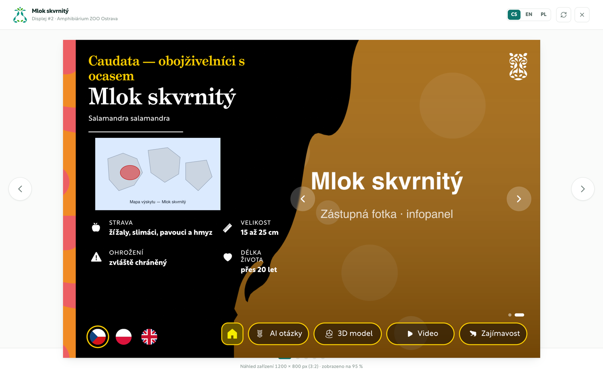

*Obrázek 1.1 — Takhle vypadá hotový infopanel na tabletu u zvířete. Všechny
údaje na něm se vyplňují v systému. Tenhle náhled si můžete kdykoli otevřít
i vy, viz [kapitola 4](#4-jak-otevřít-konkrétní-zvíře).*

### Jak se obsah dostane na tablet

Tohle bývá první otázka, tak hned na začátek:

> **Nic nikam neodesíláte. Stačí uložit.**
> Tablet u zvířete si nový obsah vyzvedne sám, obvykle do minuty. Udělá to ve
> chvíli, kdy u něj nikdo nestojí, aby se návštěvníkovi text neměnil pod
> rukama uprostřed čtení.

Nemusíte tedy hledat žádné tlačítko „odeslat“. Podrobněji je to v
[kapitole 11](#11-uložení-dvě-tlačítka-a-v-čem-se-liší).

### Co je „slide“

V celém systému i v téhle příručce narazíte na slovo **slide**. Je to
anglické slovo, ale používá ho i samotný systém, takže ho tu necháváme, ať
se v tom neztratíte.

> **Slide = jedna obrazovka, kterou tablet ukáže.**

Jeden tablet jich má několik za sebou a návštěvník mezi nimi přepíná, jako
když listuje v knize. U jednoho zvířete tak může být:

| Slide | Co na něm je |
|---|---|
| **Infopanel** | název druhu, strava, velikost, fotky, mapa výskytu |
| **Informace** | dva delší texty o druhu a zařazení (třída, řád, čeleď) |
| **Galerie** | fotky a videa za sebou, tablet je střídá |
| **3D model** | model zvířete, který se dá otáčet dokola |
| **AI otázky** | chat s umělou inteligencí, nic se do něj nevyplňuje |

Který slide u kterého zvířete bude, si určujete sami
([kapitola 10](#10-přidání-a-přesun-slidů)).

---

## 2. Přihlášení a výběr jména

Přihlášení má dva kroky. Nejdřív se přihlásíte do systému. Potom vyberete
ze seznamu své jméno. Za chvíli si vysvětlíme, proč to tak je.

### Co si připravit

Od správce systému potřebujete tři věci:

- **adresu**, kterou napíšete do prohlížeče,
- **přihlašovací jméno**,
- **heslo**.

Nejspíš je má celý pavilon stejné. To je v pořádku, je to tak schválně.

### Krok za krokem

**1. Otevřete v prohlížeči adresu systému.**

Napíšete ji nahoru do řádku, kam se píšou webové adresy. Objeví se
přihlašovací obrazovka se zeleným znakem ZOO Ostrava.

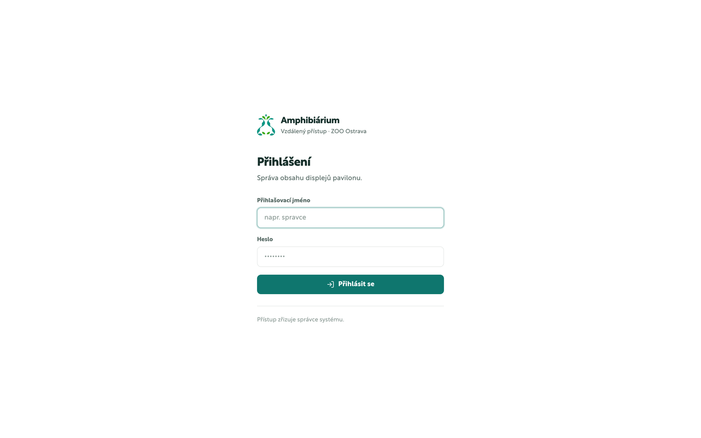

*Obrázek 2.1 — Přihlašovací obrazovka.*

**2. Vyplňte přihlašovací jméno a heslo.**

Do horního políčka napište jméno, do spodního heslo.

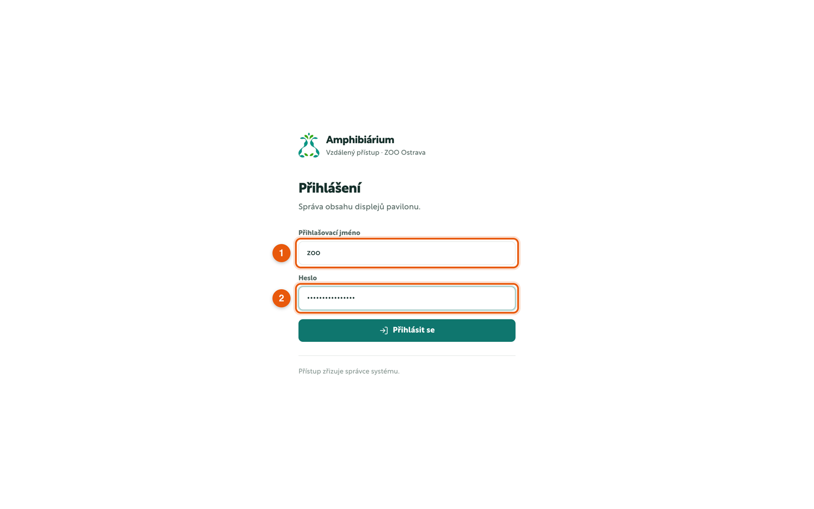

*Obrázek 2.2 — Rámeček 1 je přihlašovací jméno, rámeček 2 heslo.*

U přihlašovacího jména **nezáleží na velkých a malých písmenech**. Ať napíšete
`zoo` nebo `ZOO`, systém to vezme.

U hesla na velikosti písmen **záleží**. Když vám to nejde, zkontrolujte
nejdřív klávesu Caps Lock.

**3. Klikněte na Přihlásit se.**

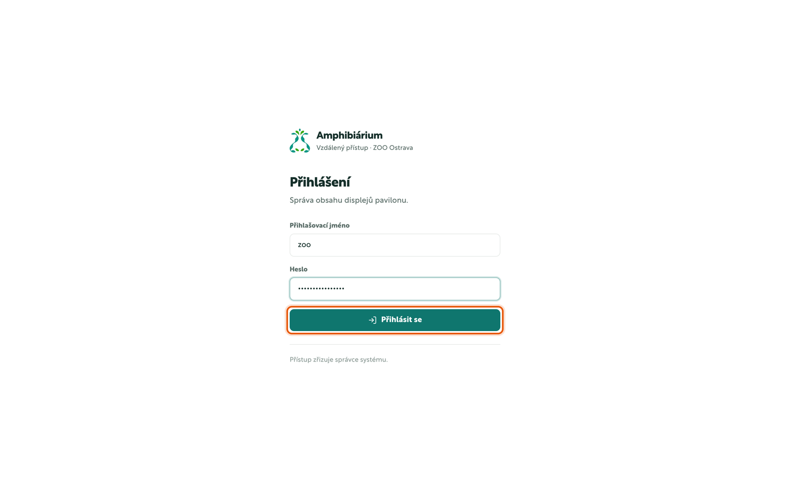

*Obrázek 2.3 — Tlačítko „Přihlásit se“.*

Když se něco nepovede, systém napíše jen „Neplatné přihlašovací údaje.“
Neřekne, jestli bylo špatně jméno, nebo heslo. Je to tak schválně, kvůli
bezpečnosti. Zkuste to znovu, a když to nepůjde ani napotřetí, ozvěte se
správci.

Když zapomenete heslo, kontaktujte správce systému.

### Výběr jména

Hned po přihlášení se objeví obrazovka s otázkou **„Kdo pracuje?“** a se
seznamem jmen.

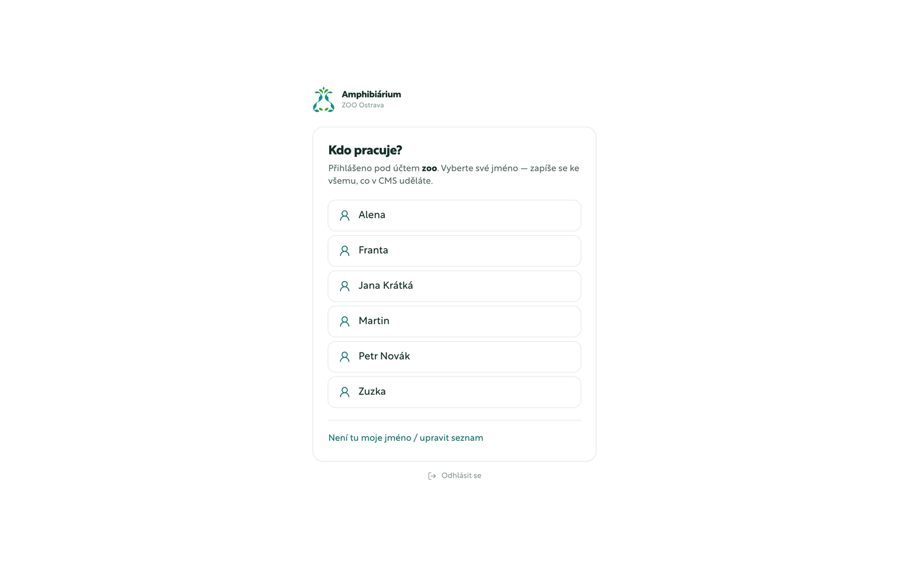

*Obrázek 2.4 — Obrazovka výběru jména.*

**4. Klikněte na své jméno.**

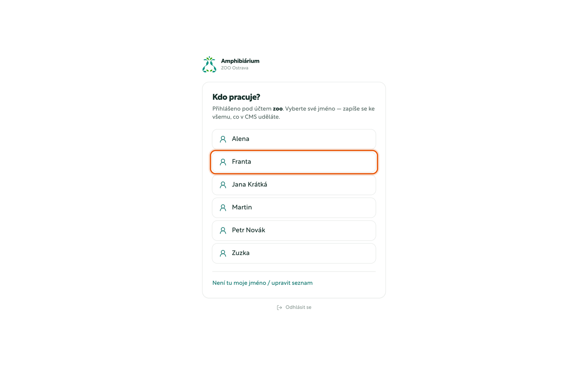

*Obrázek 2.5 — Stačí kliknout na své jméno v seznamu.*

A je hotovo. Systém vás pustí dál a otevře se přehled.

### Proč se vybírá jméno

Celý pavilon má **jedno společné přihlašovací jméno a heslo**. To je
praktické, nikdo si nemusí pamatovat vlastní. Má to ale jednu nevýhodu: systém
by pak nepoznal, kdo u počítače zrovna sedí.

A to potřebuje vědět. Ke každé změně si totiž zapisuje, kdo ji udělal. Když
se za tři měsíce někdo zeptá „kdo přepsal text u mloka?“, musí být z čeho to
zjistit.

Proto ten výběr jména. Říkáte jím systému: *teď tady sedím já*.

> **Není to druhé heslo.**
> Nic tajného tam nepíšete a nikdo se tím k ničemu nedostane. Je to jen
> podpis, jako když se podepíšete do sešitu u přístroje.

**Ptá se na to pokaždé, když se přihlásíte.** Systém si vaše jméno záměrně
nepamatuje. Kdyby si ho pamatoval, podepsal by vaším jménem i kolegu, který
si k počítači sedne po vás.

### Když tam vaše jméno není

Třeba jste nový nebo se seznam mezitím pročistil. Nevadí, přidáte si ho sami,
nemusíte nikoho shánět.

**1. Klikněte na odkaz „Není tu moje jméno / upravit seznam“** pod seznamem.

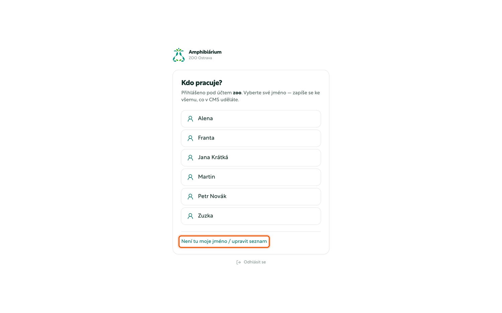

*Obrázek 2.6 — Odkaz „Není tu moje jméno / upravit seznam“.*

**2. Napište své jméno do políčka a klikněte na Přidat.**

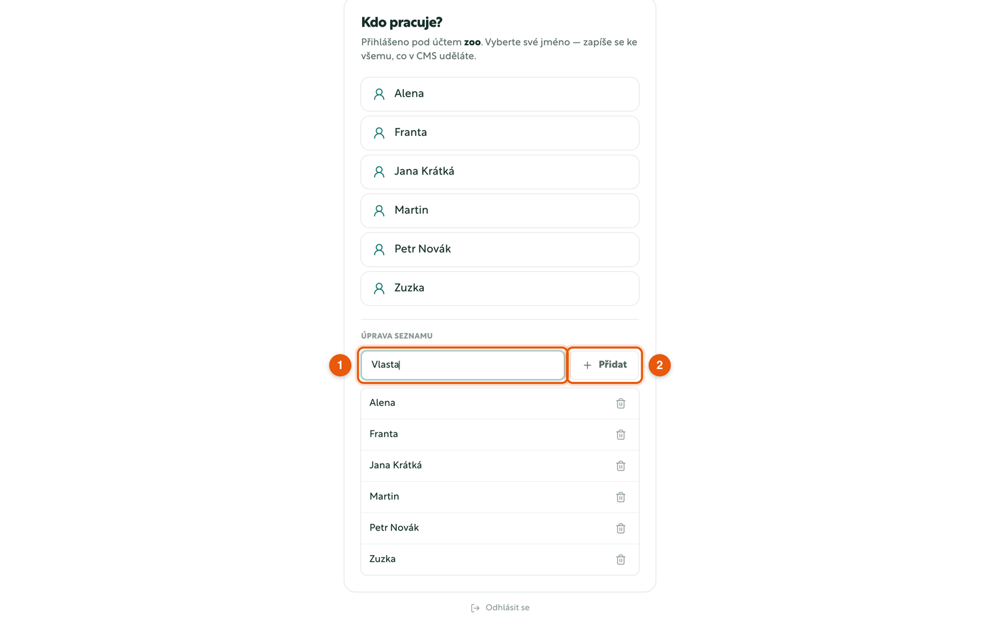

*Obrázek 2.7 — Do políčka 1 napište jméno, tlačítkem 2 ho přidáte. Pod tím je
celý seznam, u každého jména je koš na smazání.*

**3. Teď už své jméno v seznamu uvidíte. Klikněte na ně.**

Můžete napsat křestní jméno, celé jméno, jak chcete. Hlavně ať je poznat, kdo
to je. „Franta“ stačí, „F.“ už ne.

Stejným způsobem jde jméno ze seznamu i odebrat, přes ikonu koše vedle něj.
Když někdo odejde, klidně ho smažte. **Nic se tím nesmaže zpětně** — u starých
změn jeho jméno zůstane, a to je správně.

Seznam jmen jde upravovat i později, za chodu: v levém menu přes položku
**Nastavení**. Nemusíte se kvůli tomu odhlašovat.

### Jak dlouho přihlášení vydrží

Systém vás sám odhlásí **po hodině, kdy s ním nic neděláte**. Je to kvůli
tomu, aby se pod vaším jménem nezapsal někdo, kdo si k volnému počítači sedne
po vás.

Nebojte se, že vás to odstřihne uprostřed práce. **Minutu předtím se dole
objeví upozornění** s tlačítkem „Pokračovat v práci“. Stačí na ně kliknout
a pracujete dál.

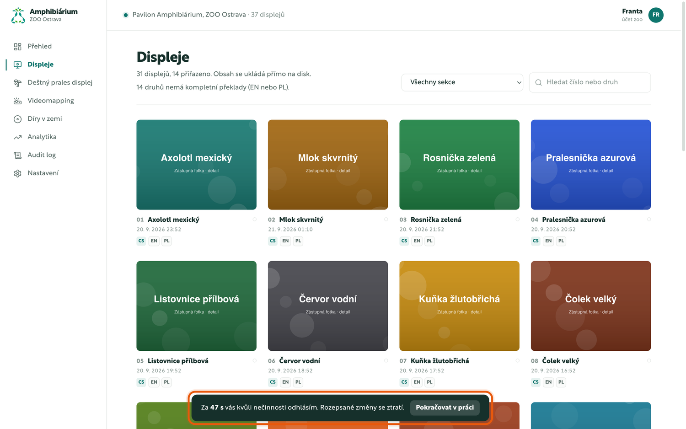

*Obrázek 2.8 — Upozornění se objeví dole uprostřed. Kliknutím na „Pokračovat
v práci“ se hodina počítá od začátku.*

Psaní, klikání a posouvání se počítá jako práce. Hodina se tedy začne měřit
až ve chvíli, kdy od počítače opravdu odejdete.

Když vás systém přesto odhlásí, přihlásíte se znovu a vyberete jméno. Uložené
změny jsou v pořádku. Přijdete jen o to, co jste měli rozepsané a neuložené —
proto se vyplatí ukládat průběžně.

Odhlásit se můžete i sami, tlačítkem **Odhlásit** úplně dole v levém sloupci.

---

## 3. Co je kde

Obrazovka má tři části:

- **vlevo** svislý sloupec s nabídkou,
- **nahoře** lišta s vaším jménem,
- **uprostřed** pracovní plocha, kde se všechno odehrává.

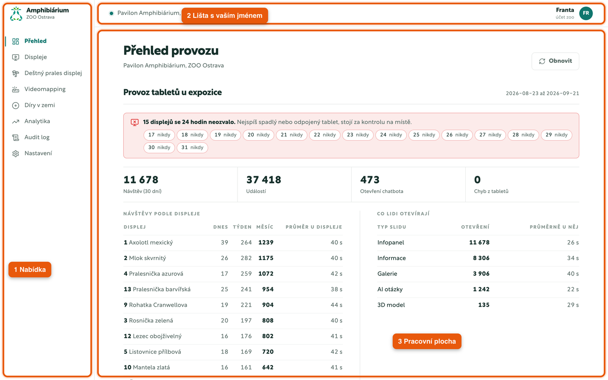

*Obrázek 3.1 — 1 nabídka, 2 lišta s vaším jménem, 3 pracovní plocha.*

### Levé menu

| Položka | K čemu je |
|---|---|
| **Přehled** | Souhrn, jak pavilon běží. Kolik tabletů se hlásí, na co se lidé ptají umělé inteligence, mapa dotazů na půdorysu pavilonu. Pro plnění obsahu ji nepotřebujete. |
| **Displeje** | **Tady budete trávit nejvíc času.** Přehled všech zvířat a jejich obsahu. |
| **Deštný prales displej** | Samostatný displej u deštného pralesa. Nastavuje se jinak než ostatní, viz [kapitola 14](#14-displej-u-deštného-pralesa). |
| **Videomapping** | Zapnutí a vypnutí dvou instalací v pavilonu, viz [kapitola 15](#15-videomapping-zapnutí-a-vypnutí). |
| **Díry v zemi** | Dva zapuštěné prvky v podlaze. U každého je jedno video, které jde vyměnit. |
| **Analytika** | Kolik lidí se u displejů zastavuje, viz [kapitola 12](#12-analytika-kolik-lidí-se-u-displejů-zastaví). |
| **Audit log** | Kdo, kdy a co v systému změnil. |
| **Nastavení** | Seznam jmen pro přihlašování. |

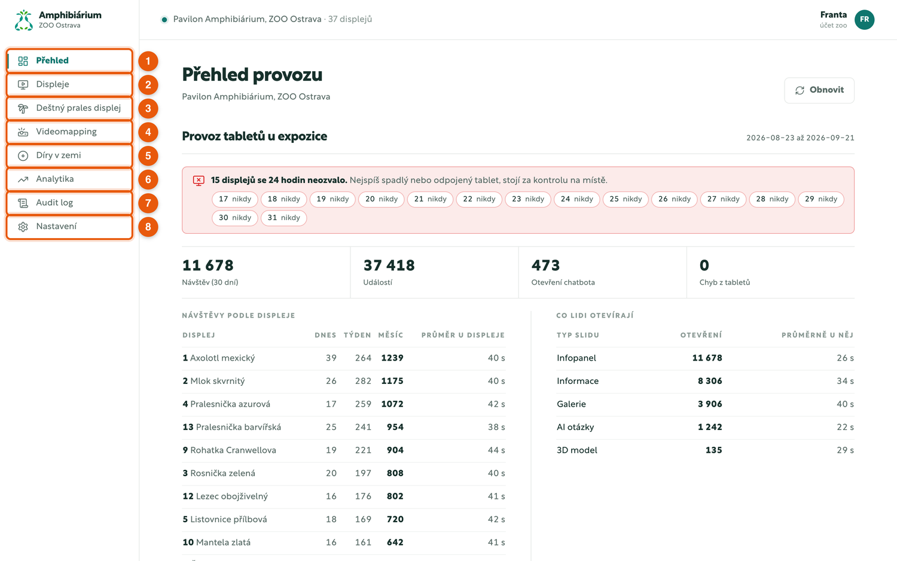

*Obrázek 3.2 — Položky v levém menu v pořadí podle tabulky výš. Úplně dole je
tlačítko „Odhlásit“.*

### Lišta nahoře

Vpravo nahoře je vidět, **pod jakým jménem pracujete**. Pod ním je drobným
písmem účet, kterým jste se přihlásili.

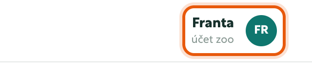

*Obrázek 3.3 — Vaše jméno a pod ním účet.*

Když tam uvidíte cizí jméno, nepracujete pod svým. Odhlaste se a přihlaste
znovu.

---

## 4. Jak otevřít konkrétní zvíře

**1. V levém menu klikněte na Displeje.**

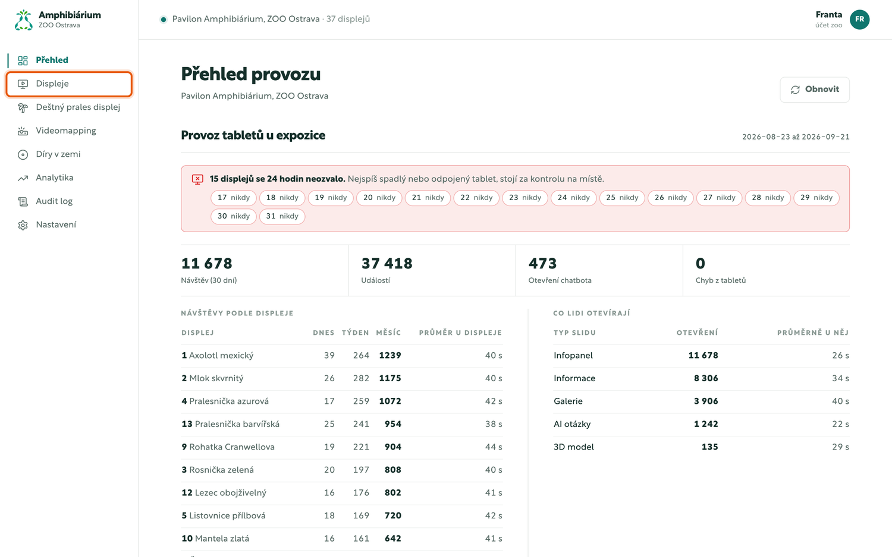

*Obrázek 4.1 — Položka „Displeje“ v levém menu.*

Objeví se přehled všech displejů v pavilonu. Každý displej je jedna dlaždice:
nahoře fotka, pod ní číslo a druh zvířete, datum poslední změny a tři odznaky
jazyků (CS, EN, PL).


*Obrázek 4.2 — Přehled displejů. Dlaždice bez fotky a s nápisem „Nepřiřazeno“
jsou displeje, které zatím nemají obsah.*

**2. Najděte to svoje.**

Buď sjeďte očima dlaždice, nebo použijte políčko **Hledat číslo nebo druh**
nahoře vpravo. Můžete napsat číslo displeje i část názvu zvířete.

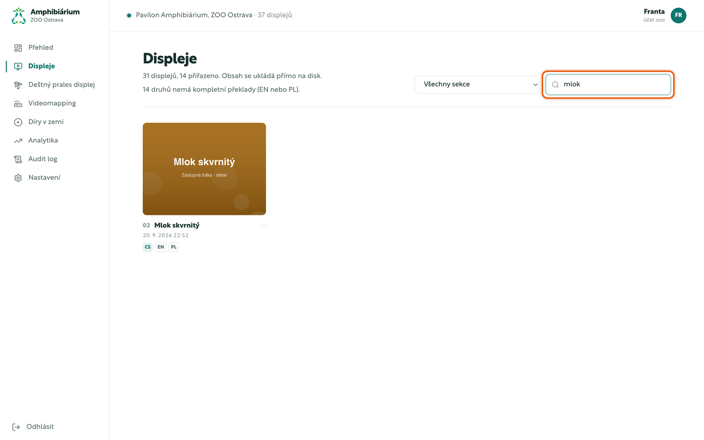

*Obrázek 4.3 — Do vyhledávacího políčka stačí napsat část názvu. Vedle je
ještě rozbalovací seznam „Všechny sekce“, kterým jde přehled zúžit na jedno
téma pavilonu.*

**3. Klikněte na dlaždici displeje.**

Otevře se editor, kde už se dá psát.

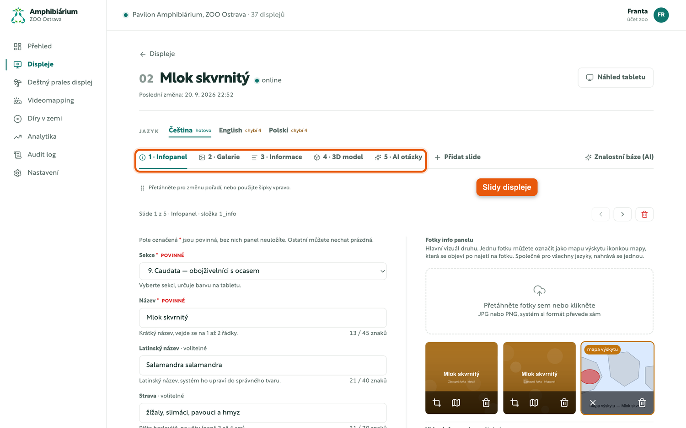

*Obrázek 4.4 — Otevřený displej. Zvýrazněná je řada záložek se slidy.*

### Barevná tečka u displeje

U každé dlaždice je vpravo od názvu malé kolečko. Říká, jestli se tablet
ozývá.

| Tečka | Znamená |
|---|---|
| 🟢 zelená | **online** — tablet se hlásí, všechno v pořádku |
| 🟠 oranžová | **vypadává** — chvíli se neozval, možná má výpadek sítě |
| 🔴 červená | **offline** — delší dobu se neozval, nejspíš je vypnutý |
| ⚪ prázdná | **zatím se neozval** — od zapnutí systému z něj nic nepřišlo |

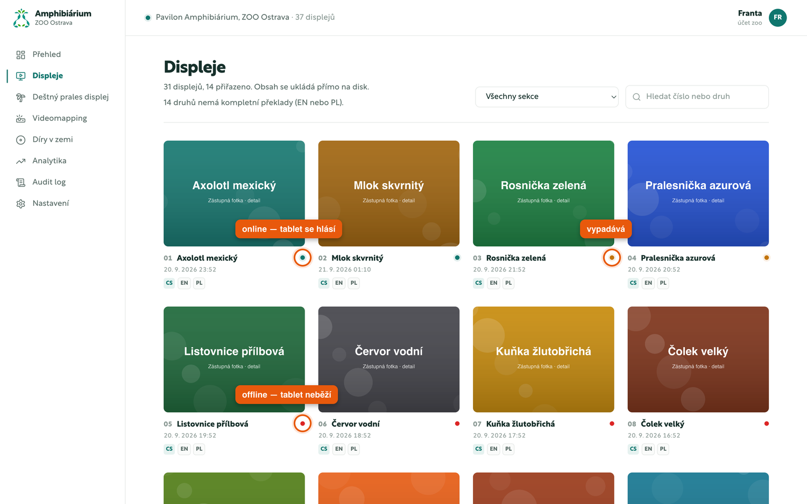

*Obrázek 4.5 — Tři stavy vedle sebe: zelená, oranžová a červená. Prázdné
kolečko (čtvrtý stav) se ukazuje jen krátce po zapnutí systému, než se tablety
stihnou poprvé ozvat.*

> **Červená tečka není vaše starost.**
> Znamená, že tablet v pavilonu neběží, ne že byste něco udělali špatně.
> Obsah můžete klidně psát dál, tablet si ho vyzvedne, jakmile ho někdo
> zapne. Když červená tečka svítí dlouho, dejte vědět správci.

### Záložky se slidy

Po otevření displeje je nahoře vodorovná řada záložek, jedna pro každý slide:

```
1 · Infopanel   2 · Galerie   3 · Informace   4 · 3D model   5 · AI otázky
```

Kliknutím na kteroukoli z nich se přepnete na její obsah. Čísla odpovídají
pořadí, v jakém slidy uvidí návštěvník na tabletu.

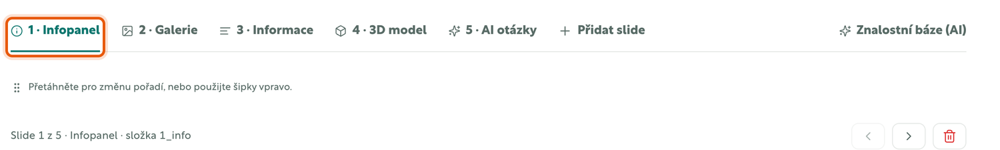

*Obrázek 4.6 — Řada záložek. Aktivní záložka je zelená a podtržená. Pod ní je
řádek, který říká, na kterém slidu zrovna jste — například „Slide 1 z 5 ·
Infopanel“.*

Úplně vpravo v téže řadě je ještě **Znalostní báze (AI)**. Je to podklad, ze
kterého odpovídá umělá inteligence. Pro běžné plnění obsahu ji nepotřebujete,
ale když chcete, aby AI o druhu věděla víc, je to místo, kam se to píše.

### Náhled tabletu

Vpravo nahoře nad záložkami je tlačítko **Náhled tabletu**. Otevře nové okno
a ukáže displej přesně tak, jak ho uvidí návštěvník.

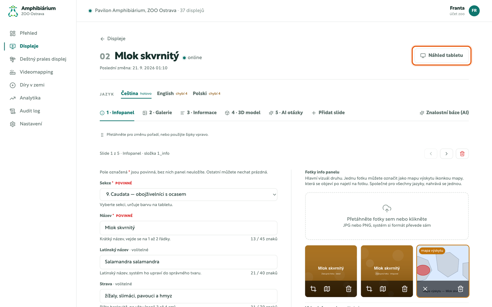

*Obrázek 4.7 — Tlačítko „Náhled tabletu“ vpravo nahoře.*

Je to nejrychlejší způsob, jak si zkontrolovat vlastní práci: uložíte text
a hned se podíváte, jestli se na obrazovku vejde a dobře vypadá. Náhled ukazuje
**uložený** obsah, takže rozepsané změny v něm ještě nejsou.

---

## 5. Úprava textů na info panelu

Infopanel je hlavní obrazovka u zvířete. Jsou na ní základní údaje a fotky.

**1. Otevřete displej a nahoře klikněte na záložku Infopanel.**

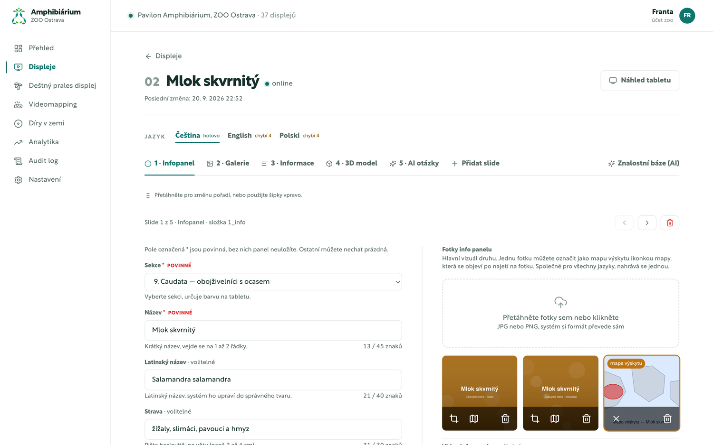

*Obrázek 5.1 — Editor infopanelu. Vlevo jsou textová pole, vpravo fotky.*

### Která pole musíte vyplnit

Bez těchhle dvou se slide neuloží:

- **Sekce** — vybírá se ze seznamu, nedá se napsat vlastní text. Odpovídá
  tabulím v pavilonu a určuje barvu displeje.
- **Název** — český název druhu.

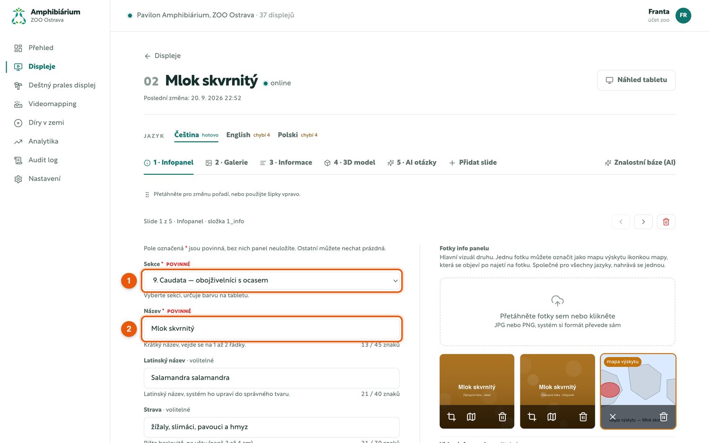

*Obrázek 5.2 — Povinná pole: 1 Sekce, 2 Název. Poznáte je podle červené
hvězdičky a slova POVINNÉ.*

Všechna ostatní pole jsou nepovinná. Když o zvířeti něco nevíte, nechte
políčko prázdné. Tablet ten řádek prostě neukáže. **Nevymýšlejte si údaj jen
proto, aby políčko nebylo prázdné.**

### Všechna pole a jejich limity

| Pole | Nejvíc znaků | Poznámka |
|---|---|---|
| Sekce | — | vybírá se ze seznamu, povinné |
| **Název** | 45 | povinné |
| Latinský název | 40 | systém ho sám upraví, viz níž |
| Strava | 70 | |
| Velikost | 40 | |
| Doba líhnutí | 20 | |
| Ohrožení | 25 | |
| Délka života | 20 | |
| Čeleď (taxonomická) | — | **na tabletu se neukazuje**, viz níž |

Pod každým polem je šedá nápověda, co do něj patří. Vpravo u pole je
**počítadlo znaků**, třeba „31 / 70 znaků“.

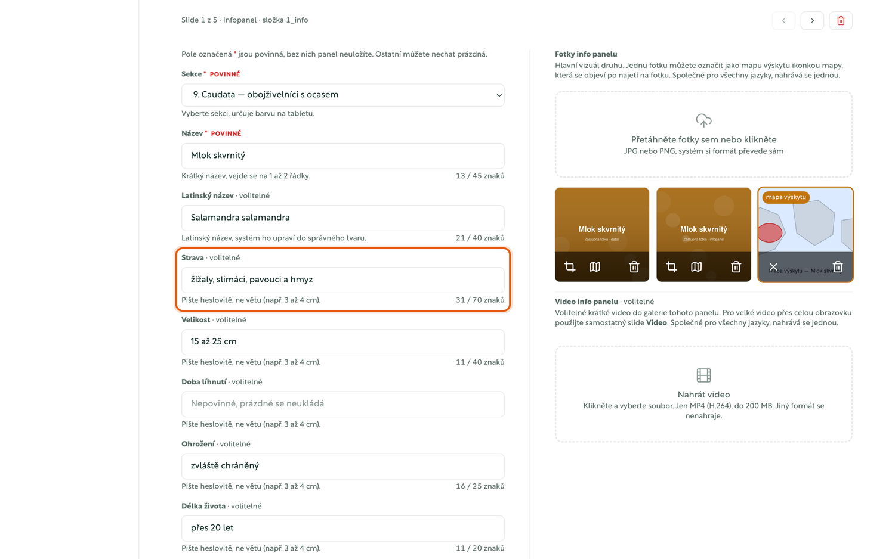

*Obrázek 5.3 — Pole „Strava“: nahoře popisek, pod ním nápověda a vpravo
počítadlo znaků.*

Poslední pole, **Čeleď (taxonomická)**, je výjimka. Návštěvník ho nikdy
neuvidí. Píše se do něj latinský název čeledi (například `Salamandridae`)
a slouží jen umělé inteligenci, aby poznala, o jaký druh jde. České zařazení
pro návštěvníka se vyplňuje jinde, na slidu „Informace“
([kapitola 6](#6-slide-informace)).

### Když je text moc dlouhý

Limity nejsou doporučení. **Systém delší text neuloží.**

Je to proto, že tablet má pevné rozvržení. Delší text by se do něj nevešel
a návštěvníkovi by se rozsypal nebo usekl uprostřed slova.

Když limit překročíte, stane se tohle:

1. Políčko **zčervená**.
2. Počítadlo zčervená a napíše, o kolik jste přes, například „o 11 přes
   limit“, a pod polem se objeví červené vysvětlení.
3. Nad tlačítky se červeně vypíše, které pole je moc dlouhé. **Když přesto
   kliknete na Uložit, systém to neuloží** a napíše „Zkraťte prosím: …“.

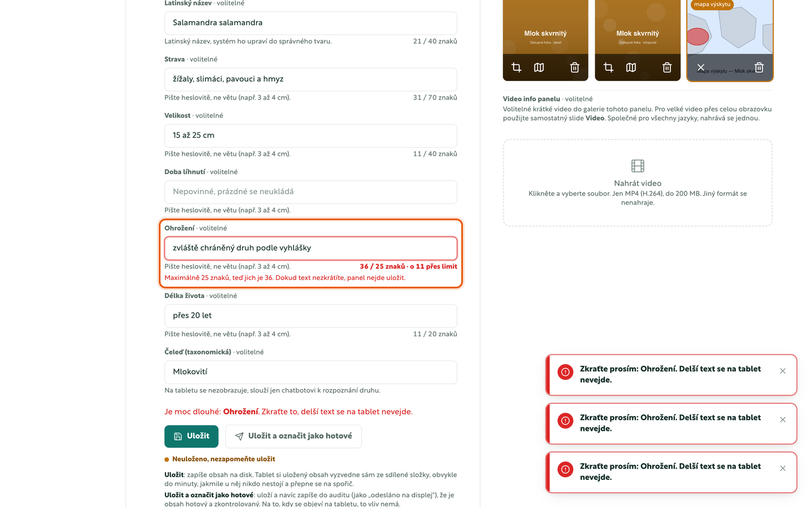

*Obrázek 5.4 — Červený rámeček, červené počítadlo a vysvětlení pod polem.
Dole je vidět i hláška, která se objeví po kliknutí na „Uložit“.*

**Co s tím:** zkraťte text v tom poli, které svítí červeně. Jakmile se
vejdete, červená zmizí sama a uložit půjde.

Pár tipů na zkrácení:

- Vynechte, co se dá poznat z fotky („hnědý“, „malý“).
- Místo věty stačí údaj: ne „Dožívá se až 25 let“, ale „až 25 let“.
- Zkratky se vejdou líp: „cca“ místo „přibližně“.

> **Nebojte se, o text nepřijdete.**
> Systém vám nic nesmaže ani neusekne. Jen počká, až to zkrátíte vy.

### Latinský název se upraví sám

Latinský název se píše zvláštním způsobem: rodové jméno s velkým písmenem,
druhové s malým, například *Salamandra salamandra*.

Nemusíte to hlídat. **Napište to, jak chcete, a systém to po uložení sám
upraví** do správného tvaru. Když to udělá, napíše vám to v zelené hlášce
v rohu obrazovky.

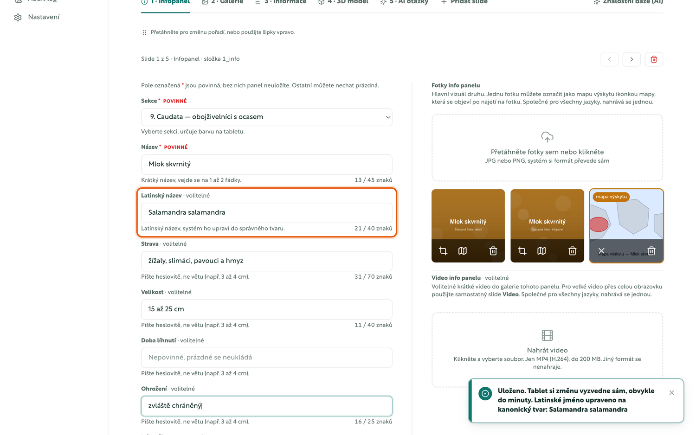

*Obrázek 5.5 — Do pole bylo napsáno „salamandra Salamandra“. Po uložení
systém hlásí, že název upravil na „Salamandra salamandra“.*

### Přepínání jazyků

Nahoře nad slidy jsou tři záložky: **Čeština**, **English**, **Polski**.

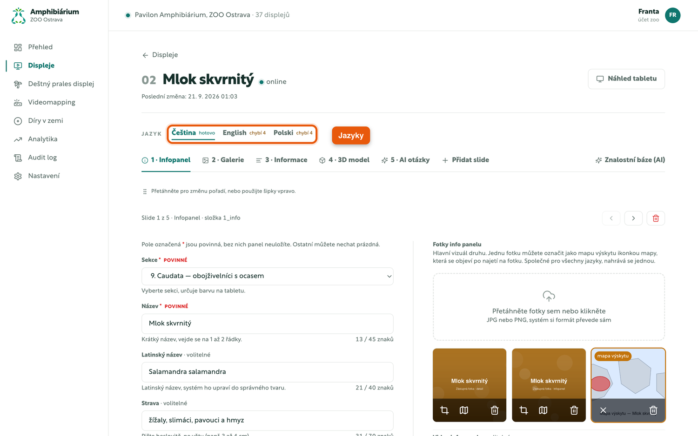

*Obrázek 5.6 — Záložky jazyků. U každé je vidět, jak je daný jazyk vyplněný.*

U každé je vidět, jak na tom je:

- **hotovo** — v tomhle jazyce je vyplněné všechno,
- **chybí 4** — čtyři položky ještě chybí.

Přepnutím záložky se přepne celý editor do daného jazyka. Píšete pak
překlady týchž polí. Pod každým polem přitom vidíte, **co je na tomtéž místě
česky**, takže nemusíte nic hledat v jiném okně.

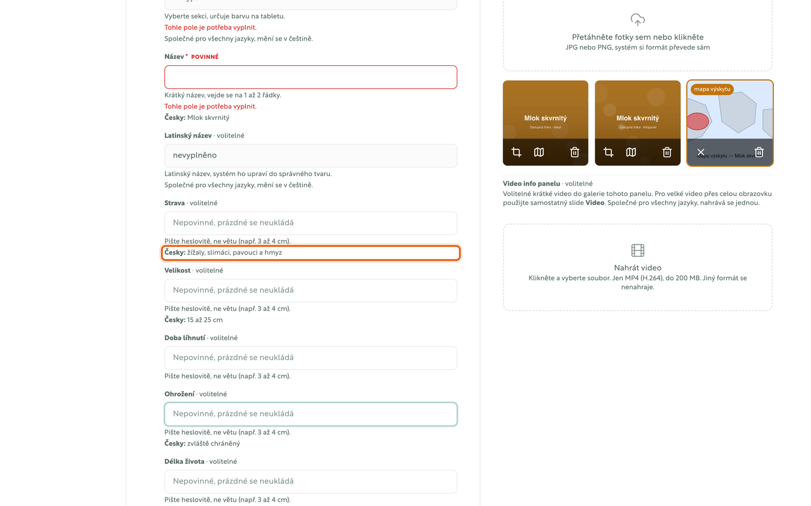

*Obrázek 5.7 — Při psaní překladu je pod polem šedě vypsaný český text.*

> **Fotky, videa a 3D model jsou společné pro všechny jazyky.**
> Nahráváte je jen jednou, v češtině. Do angličtiny a polštiny se propíšou
> samy. Překládá se jen text.

**Sekci a latinský název** nastavujete jen v češtině. Sekce se přeloží sama
a latinský název je ve všech jazycích stejný, proto v ostatních jazycích
nejdou měnit. Systém to u nich i napíše: „Společné pro všechny jazyky, mění
se v češtině.“

---

## 6. Slide „Informace“

Tenhle slide je na delší povídání o druhu. Zatímco infopanel jsou stručné
údaje, tady je prostor na souvislý text.

**1. Otevřete displej a nahoře klikněte na záložku Informace.**

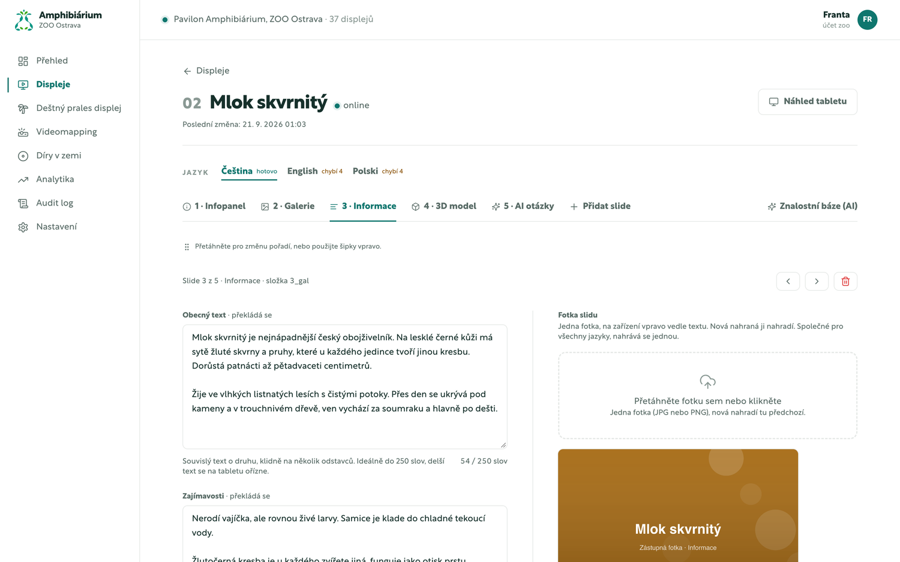

*Obrázek 6.1 — Editor slidu „Informace“.*

### Co se vyplňuje

| Pole | Co do něj patří |
|---|---|
| **Obecný text** | Souvislý text o druhu, klidně na několik odstavců. |
| **Zajímavosti** | Co návštěvníka zaujme. Klidně několik bodů pod sebou. |
| **Třída** | Například „Obojživelníci“. |
| **Řád** | Například „Žáby“. |
| **Čeleď** | Například „Pralesničkovití“. |

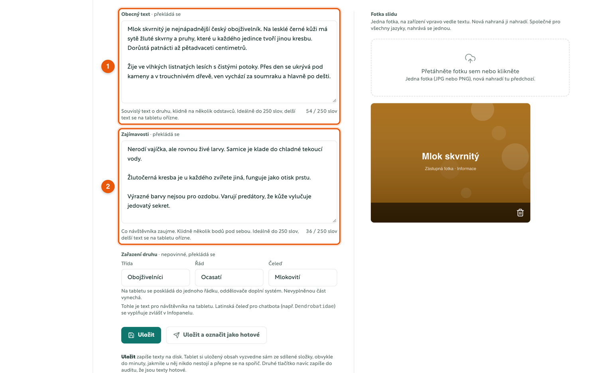

*Obrázek 6.2 — 1 Obecný text, 2 Zajímavosti. U obou je vpravo počítadlo slov.*

Poslední tři políčka jsou pod sebou ve skupince **Zařazení druhu**. Na tabletu
se poskládají do jednoho řádku a oddělovače doplní systém. Co nevyplníte, to
vynechá.

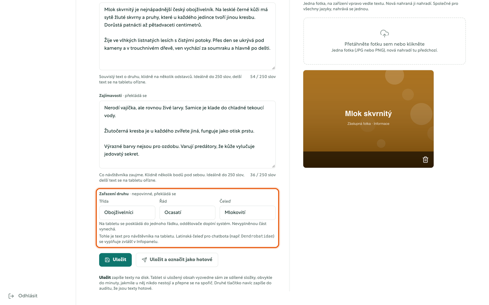

*Obrázek 6.3 — Skupinka „Zařazení druhu“: Třída, Řád, Čeleď.*

> **Tady se píše česky, pro návštěvníka.**
> Latinská čeleď pro umělou inteligenci (například `Salamandridae`) se
> vyplňuje jinde, na Infopanelu. Jsou to dvě různé věci, nepleťte si je.

### U dlouhých textů je limit jen doporučený

U obecného textu a zajímavostí je **doporučení 250 slov** na pole. Na rozdíl
od infopanelu je to opravdu jen doporučení — **delší text systém uloží**.

Má to ale háček: **text se na tabletu neroluje.** Co se nevejde, návštěvník
neuvidí. Když počítadlo zoranžoví, koukněte se raději na náhled tabletu, jestli
se text vejde.

K tomuhle slidu patří i **jedna fotka**. Nová nahraná nahradí tu předchozí.
Nahrává se stejně jako ostatní, viz [kapitola 7](#7-fotky-a-jejich-oříznutí).

---

## 7. Fotky a jejich oříznutí

Fotky se nahrávají skoro všude stejně, ať jste na infopanelu, v galerii nebo
u slidu Informace.

### Jak nahrát fotku

**1. Najděte rámeček s nápisem „Přetáhněte fotky sem nebo klikněte“.**

Je to velká plocha s čárkovaným okrajem a s ikonkou obláčku uprostřed.


*Obrázek 7.1 — Sem se fotky přetahují, nebo se na plochu klikne a vyberou se
z počítače.*

**2. Buď do něj přetáhněte soubory myší, nebo na něj klikněte** a vyberte
fotky z počítače.

Můžete vybrat i víc fotek najednou.

**3. Počkejte, až zmizí kolečko načítání.**


*Obrázek 7.2 — Nahrané fotky. Pod každou je tmavý proužek s ikonkami.*

> **Fotky se ukládají hned.**
> Nemusíte pak mačkat žádné „Uložit“. Jakmile se objeví náhled, je fotka
> uložená na disku a tablet si ji vyzvedne.

Nahrávejte **JPG nebo PNG**. Systém si je sám převede do formátu, který umí
tablet přečíst, a sám je i správně otočí podle toho, jak byly vyfocené.

### Oříznutí fotky

Tablet ukazuje fotky v pevném tvaru. Na infopanelu je to skoro čtverec na
výšku, v galerii širší obdélník. Vaše fotka má skoro jistě jiný tvar.

Proto se každá fotka ořízne. **Určujete, která část fotky bude vidět** —
úplně stejně jako když si na sociální síti nastavujete profilovku.

> **Nová fotka se ořízne sama, na střed.**
> Hned po nahrání je použitelná a na tabletu vypadá dobře. Ořezávat ručně
> musíte jen tehdy, když vám střed nevyhovuje — třeba když je žába v rohu
> fotky.

**1. Pod každou nahranou fotkou je tmavý proužek s ikonkami. Klikněte na tu
první, na oříznutí.**

Vypadá jako čtvereček poskládaný ze dvou rohů, jako značka pro ořez na papíře.


*Obrázek 7.3 — Zvýrazněná je ikonka oříznutí. Vedle ní je mapa a koš.*

**2. Otevře se okno s fotkou a světlým rámečkem.**

Uvnitř rámečku je to, co uvidí návštěvník. Co je venku, se zahodí.


*Obrázek 7.4 — Okno oříznutí. Světlý rámeček ukazuje, co zůstane.*

**3. Posuňte fotku tažením myši.** Rámeček zůstává na místě, hýbe se fotka
pod ním.

**4. Přibližte nebo oddalte** kolečkem myši nebo posuvníkem dole.


*Obrázek 7.5 — Táhnutím se hýbe fotka, rámeček zůstává. Dole je posuvník
přiblížení.*

**5. Klikněte na Uložit výřez.**


*Obrázek 7.6 — Tlačítko „Uložit výřez“ v okně vpravo dole.*

> **Tvar rámečku měnit nejde, a to schválně.**
> Je daný tabletem. Kdybyste ho mohli změnit, fotka by se na tabletu
> roztáhla nebo zdeformovala.

### Oříznutí jde kdykoli změnit

**Originál fotky si systém nechává stranou.** Když oříznutí nevyjde,
otevřete ho znovu a posuňte jinam. Můžete to udělat kolikrát chcete a fotka
se tím nezhorší, protože se pokaždé ořezává z originálu.

Nemusíte tedy fotku nahrávat znovu.

### Odznak „neoříznuto“

U fotek nahraných dřív, než systém oříznutí uměl, uvidíte oranžový odznak
**neoříznuto**.


*Obrázek 7.7 — Oranžový odznak „neoříznuto“ u fotky.*

Znamená to, že si u téhle fotky nikdo výřez nenastavil. Tablet ji ukáže,
ale může si ji oříznout po svém. Když máte chvíli, projděte takové fotky
a výřez u nich nastavte.

### Mapa výskytu

Na infopanelu může být kromě fotek i **mapa výskytu** — mapka, kde druh
v přírodě žije.

**1. Nahrajte mapu jako obyčejnou fotku.**

**2. V tmavém proužku pod ní klikněte na ikonku mapy** (prostřední ze tří).


*Obrázek 7.8 — Prostřední ikonka označí fotku jako mapu výskytu.*

Od té chvíle ji tablet bere jako mapu a ukáže ji na jiném místě než ostatní
fotky. Poznáte ji i v systému: dostane oranžový rámeček a odznak
„mapa výskytu“.


*Obrázek 7.9 — Označená mapa výskytu. Křížkem se označení zruší.*

> **Mapa se nikdy neořezává.**
> Je to schéma, ne fotka. Oříznutím by z ní zmizel kus světa. Proto u mapy
> ikonku oříznutí vůbec nenajdete.

Označení jde zrušit křížkem na tomtéž místě. Mapa se pak vrátí mezi běžné
fotky.

### Smazání fotky

V tmavém proužku pod fotkou klikněte na ikonu koše. Systém se zeptá, jestli to
myslíte vážně.


*Obrázek 7.10 — Potvrzovací okno před smazáním fotky.*

---

## 8. Galerie a videa

Galerie je slide, kde jdou fotky a videa za sebou a tablet je sám střídá.

**1. Otevřete displej a nahoře klikněte na záložku Galerie.**

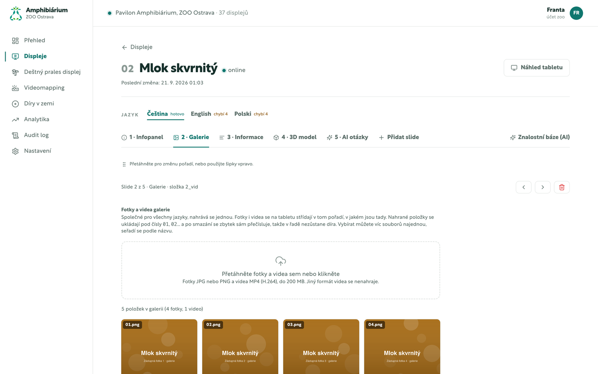

*Obrázek 8.1 — Editor galerie.*

### Přidání fotky i videa

**Fotky a videa se nahrávají na jednom místě.** Nehledejte zvlášť tlačítko na
video, žádné tu není — stejný rámeček bere obojí.

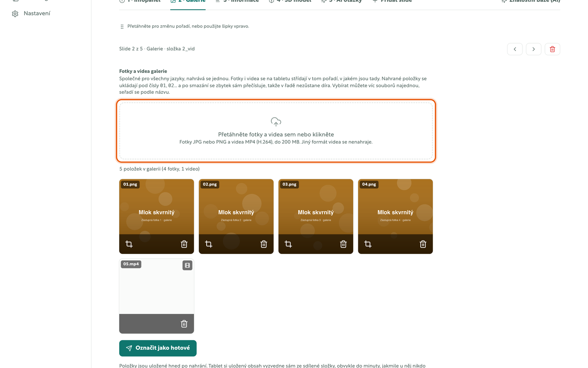

*Obrázek 8.2 — Do téhle plochy patří fotky i videa. Pod nápisem je napsané,
co systém vezme.*

Přetáhněte soubory myší, nebo na rámeček klikněte a vyberte je z počítače.
Můžete jich označit víc najednou, seřadí se podle názvu. Nová položka se
zařadí **na konec řady**.

> **Fotky JPG nebo PNG, videa jen MP4 (H.264), do 200 MB.**
> Jiný formát videa tablet nepřehraje, a systém vám ho proto nedovolí nahrát.
> Nemůže se tedy stát, že byste na tabletu objevili černou obrazovku. Když
> máte video v jiném formátu (MOV, AVI), požádejte správce o převod.

Video se **neořezává**. Nahrajte ho rovnou v takovém tvaru, v jakém má hrát.

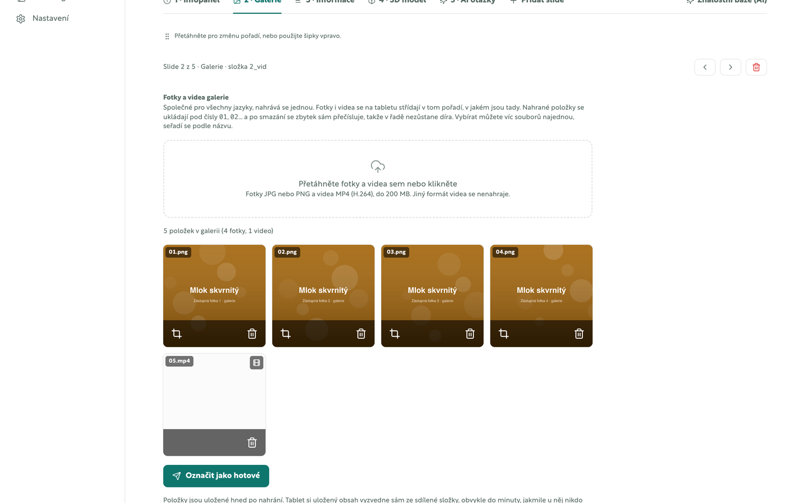

*Obrázek 8.3 — Nahrané položky. U fotek je v tmavém proužku ikonka oříznutí
a koš, u videa jen koš — video se neořezává. Nad řadou je vidět, kolik je
v galerii fotek a kolik videí.*

### Pořadí

Položky jdou na tabletu v tom pořadí, v jakém je vidíte v systému. Ukládají se
pod čísly 01, 02… Když některou smažete, zbytek se sám přečísluje a díra
v řadě nezůstane.

### Smazání

Ikona koše u položky, stejně jako u fotek. Systém se zeptá.

---

## 9. 3D model, otáčení dokola

3D model není jeden soubor. Je to **série fotek**, na kterých je zvíře
vyfocené postupně dokola. Tablet je rychle střídá, a tím vznikne dojem
otáčení.

Obvykle je jich 36 a víc.

**1. Otevřete displej a nahoře klikněte na záložku 3D model.**

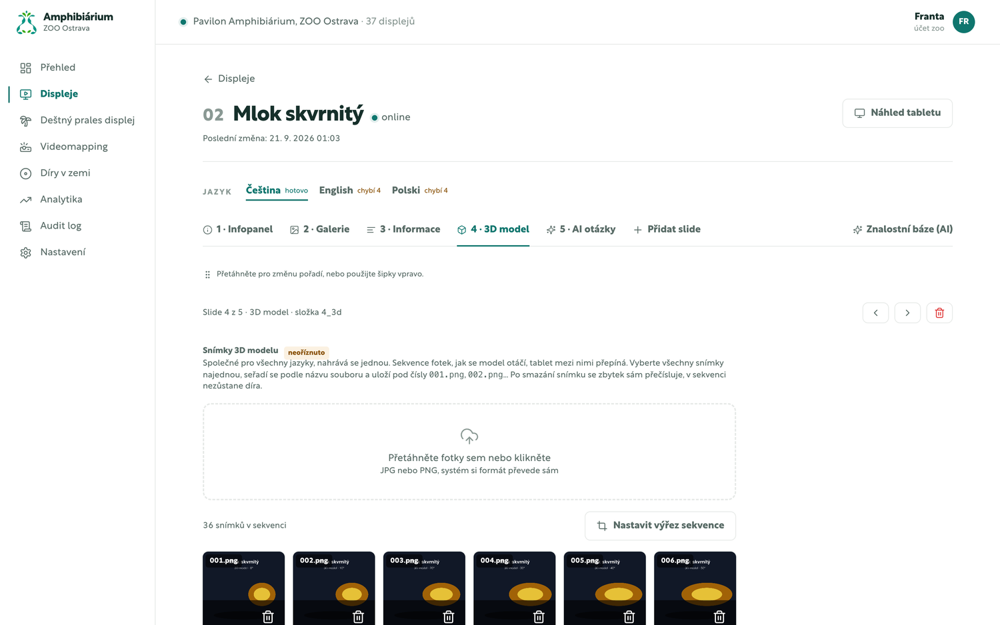

*Obrázek 9.1 — Editor 3D modelu. Dole jsou všechny snímky sekvence.*

### Nahrání série

**1. Vyberte všechny snímky najednou.** Přetáhněte je do rámečku, nebo na něj
klikněte a v okně označte celou složku.

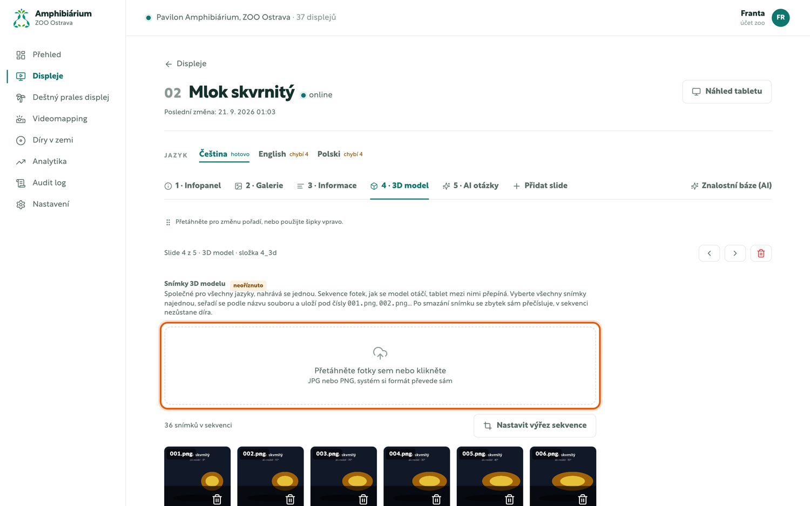

*Obrázek 9.2 — Do téhle plochy přetáhněte celou sérii naráz.*

**2. Počkejte.** Snímky se nahrávají po jednom a u velké série to chvíli trvá.
Počítadlo ukazuje, kolikátý snímek zrovna jede.

> **Na pořadí souborů záleží.**
> Systém je seřadí **podle názvu souboru**, tak jak je dostane z fotoaparátu
> nebo z renderu, a uloží pod čísly 001, 002… Když jsou pojmenované popořadě,
> otáčení bude plynulé. Přejmenovávat je nemusíte.

### Oříznutí celé série

I 3D model se ořezává. Je tu ale jeden rozdíl proti obyčejné fotce:

> **Nastavujete jeden výřez pro celou otáčku najednou, ne pro každý snímek
> zvlášť.**
> Kdyby měl každý snímek vlastní rámeček, model by při otáčení poskakoval.

**1. Klikněte na tlačítko Nastavit výřez sekvence** nad snímky.

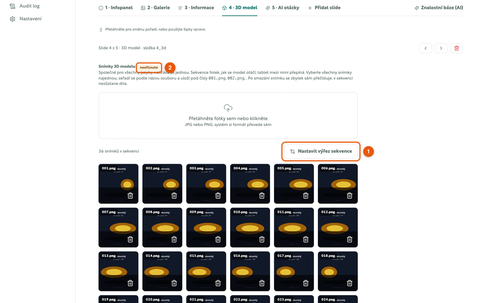

*Obrázek 9.3 — Tlačítko 1 otevře okno s výřezem. Oranžový odznak 2
„neoříznuto“ u nadpisu znamená, že u téhle série ještě nikdo výřez nenastavil.*

**2. Otevře se okno s velkým náhledem jednoho snímku.**

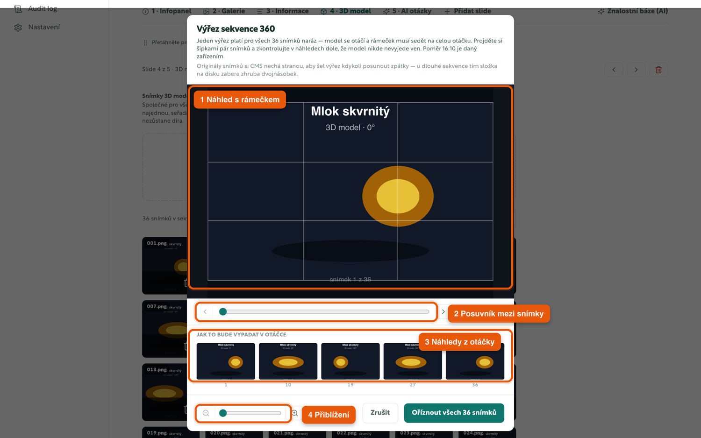

*Obrázek 9.4 — 1 náhled s rámečkem, 2 posuvník mezi snímky, 3 pruh náhledů
z otáčky, 4 přiblížení.*

**3. Projděte si pár snímků z otáčky.** Posuvníkem pod náhledem, šipkami
vedle něj nebo šipkami na klávesnici. Rámeček přitom zůstává, mění se jen
snímek pod ním.

Je to důležitý krok: zvíře je na každém snímku jinak natočené a co se vejde
zepředu, nemusí se vejít z boku.

**4. Zkontrolujte pruh náhledů dole.** Je v něm pět snímků z různých míst
otáčky, už oříznutých. Když z některého vyjede zvíře ven, výřez povolte —
tedy oddalte.

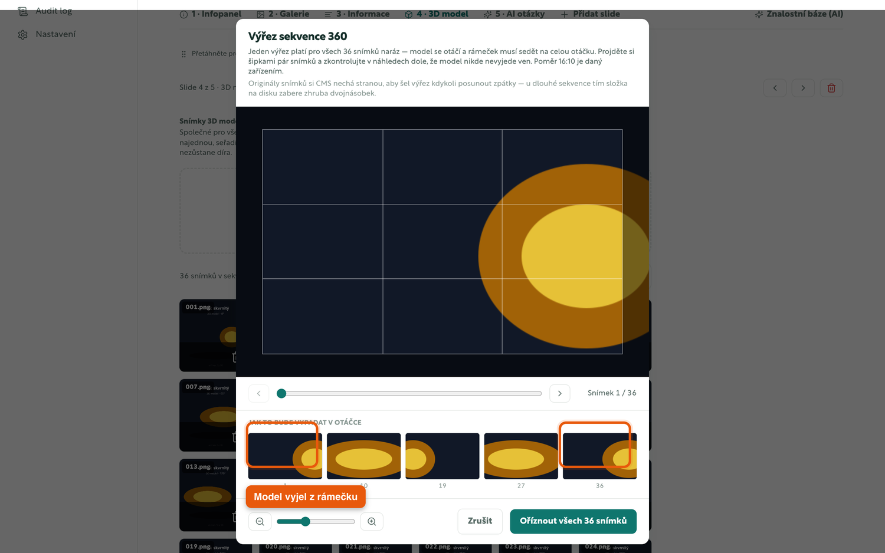

*Obrázek 9.5 — Takhle to vypadá, když je výřez moc těsný: na prvním
a posledním náhledu model vyjel ven. Oddalte posuvníkem přiblížení.*

**5. Klikněte na Oříznout všech N snímků.**

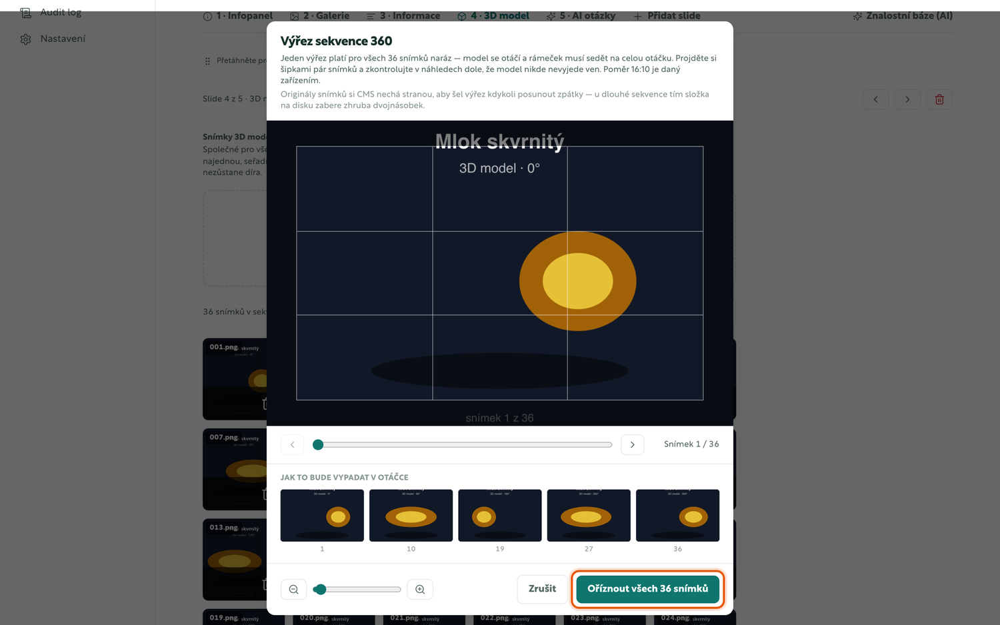

*Obrázek 9.6 — Tlačítko říká i počet snímků, kterých se ořez týká.*

**6. Počkejte, až doběhne ukazatel průběhu.**

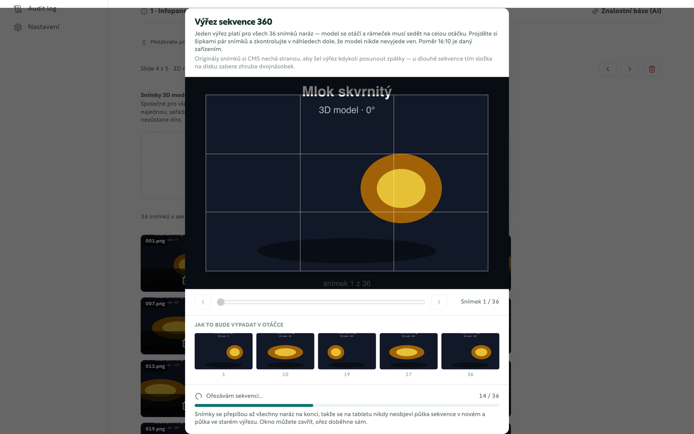

*Obrázek 9.7 — Ukazatel průběhu. Okno můžete zavřít, ořez doběhne sám.*

U velké série to trvá i desítky sekund.

> **Buď se ořízne celá série, nebo nic.**
> Nemůže se stát, že by byla půlka otáčky oříznutá a půlka ne. Kdyby se
> cokoli pokazilo, snímky zůstanou tak, jak byly, a zkusíte to znovu.

Když je série jednou oříznutá, tlačítko se přejmenuje na **Upravit výřez
sekvence** a odznak „neoříznuto“ zmizí. Výřez můžete kdykoli posunout znovu,
originály snímků si systém nechává stranou.

### Přidání snímku do hotové série

Když do už oříznuté série přidáte další snímek, **ořízne se sám stejným
výřezem** jako zbytek. Nemusíte ořezávat znovu celou otáčku.

### Smazání snímku

Ikona koše u snímku. Zbytek se sám přečísluje, v otáčce nezůstane díra.

---

## 10. Přidání a přesun slidů

Kolik slidů u zvířete bude a v jakém pořadí, si určujete sami.

### Přidání slidu

**1. Na konci řady záložek klikněte na Přidat slide.**

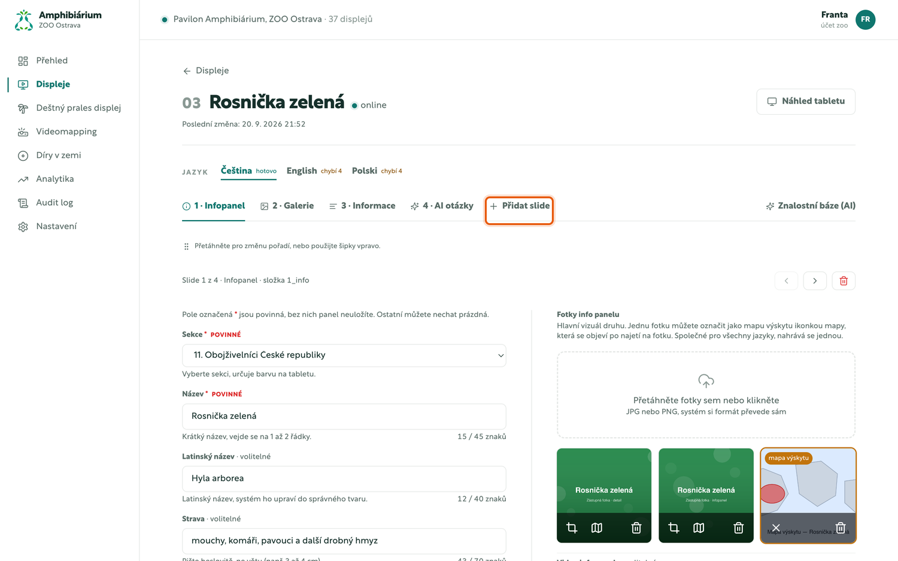

*Obrázek 10.1 — Tlačítko „Přidat slide“ na konci řady záložek.*

**2. Vyberte typ.**

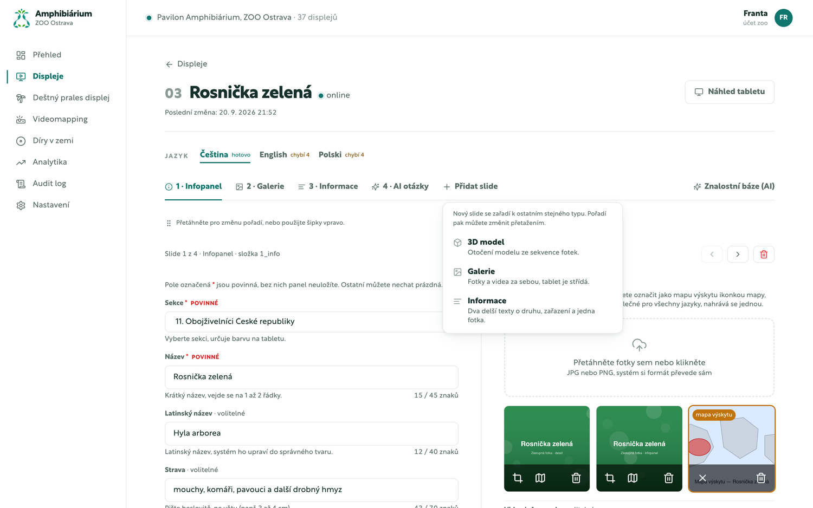

*Obrázek 10.2 — Nabídka typů. U každého je krátký popis, co na slidu bude.*

Na výběr jsou tři:

| Typ | Co na něm bude |
|---|---|
| **3D model** | Otočení modelu ze série fotek. |
| **Galerie** | Fotky a videa za sebou, tablet je střídá. |
| **Informace** | Dva delší texty o druhu, zařazení a jedna fotka. |

> **Infopanel a AI otázky v nabídce nenajdete.**
> Není to chyba. Každé zvíře je má právě jednou a zakládají se rovnou při
> zřízení displeje.

Nový slide se zařadí **hned za poslední slide stejného typu**. Když už máte
dvě galerie, třetí přibude za nimi, ne na konec za všechno.

### Přesun slidu

Jsou na to dvě cesty, vyberte si, která vám sedne víc.

**Šipkami.** Pod záložkami je vpravo dvojice šipek. Posouvají slide, na kterém
zrovna jste, o jednu pozici doleva nebo doprava.

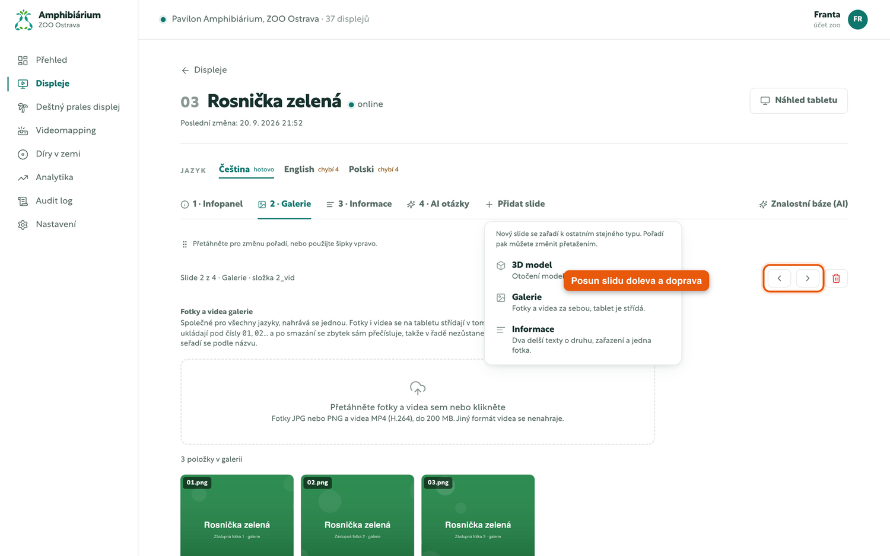

*Obrázek 10.3 — Šipky vpravo pod záložkami. Šipka je šedá, když už slide dál
posunout nejde.*

**Přetažením.** Chytněte záložku myší a přetáhněte ji na nové místo v řadě.
Svislá zelená čárka ukazuje, kam slide spadne.

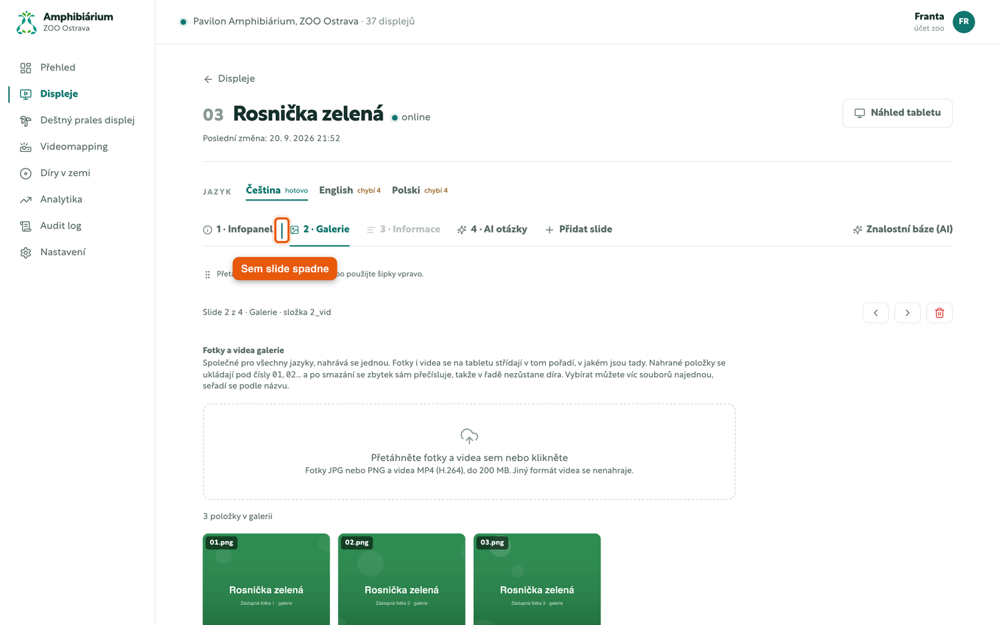

*Obrázek 10.4 — Táhne se záložka „3 · Informace“ (proto je zesvětlená). Svislá
čárka ukazuje, že spadne před „2 · Galerie“.*

Čísla se přepočítají sama. Pořadí v systému je totéž, v jakém slidy uvidí
návštěvník.

### Odebrání slidu

**1. Přepněte se na slide, který chcete odebrat.**

**2. Pod záložkami vpravo klikněte na červenou ikonu koše.**

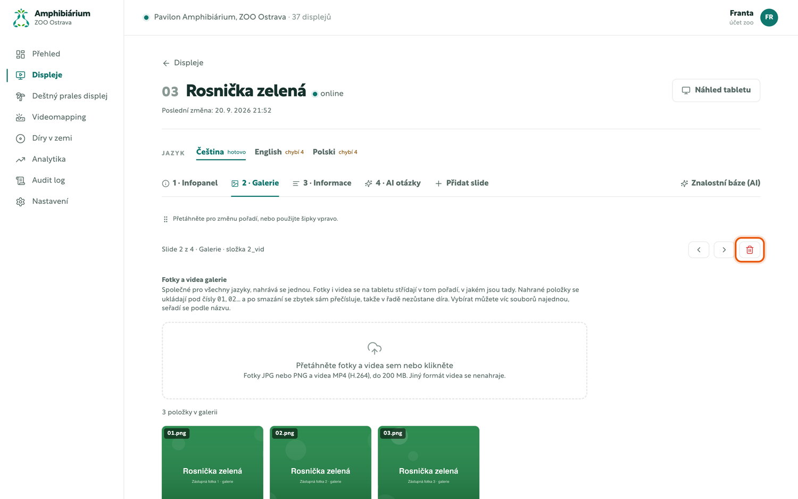

*Obrázek 10.5 — Koš je vpravo vedle šipek. Týká se slidu, na kterém právě
jste.*

**3. Potvrďte v okně, které se objeví.**

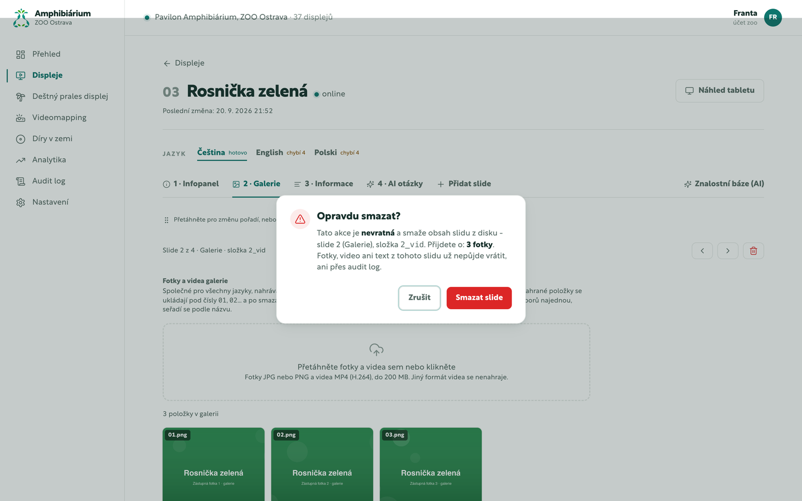

*Obrázek 10.6 — Okno napíše, o co konkrétně přijdete („Přijdete o: 3 fotky“).*

> **Tohle je jediná věc, kterou nevrátíte jedním kliknutím.**
> Se slidem zmizí i jeho texty a fotky. Systém se proto ptá a u slidu, na
> kterém něco je, nechá potvrzovací tlačítko na tři sekundy nedostupné —
> je to pojistka proti překliku. Když si nejste jistí, raději slide nechte.
> Prázdný slide na tabletu nic nezkazí.

---

## 11. Uložení: dvě tlačítka a v čem se liší

Dole pod slidem, na kterém se píše text (Infopanel a Informace), jsou dvě
tlačítka:

- **Uložit**
- **Uložit a označit jako hotové**

Na první pohled to vypadá, že jedno je „skoro uložit“ a druhé „doopravdy
uložit“. Tak to není.

> **Obě tlačítka uloží úplně stejně.**
> Ani jedno neukládá víc nebo líp. A po obou se obsah dostane na tablet
> v pavilonu sám.

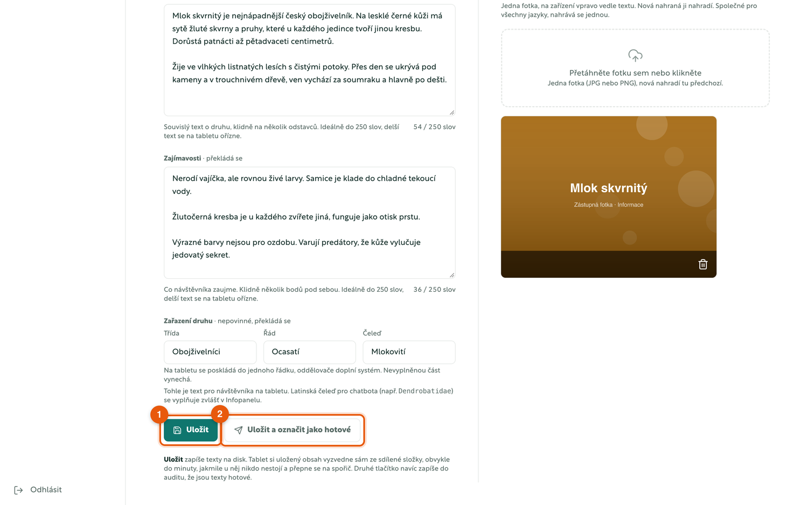

*Obrázek 11.1 — 1 „Uložit“, 2 „Uložit a označit jako hotové“. Pod nimi systém
rovnou vysvětluje, v čem je rozdíl.*

### V čem je tedy rozdíl

**Uložit** zapíše text. Nic víc. Používejte ho pořád, klidně každých pár
minut. Je to jako klávesa „uložit“ v textovém editoru.

**Uložit a označit jako hotové** udělá to samé a navíc si do záznamu poznačí:
*tenhle slide je hotový a zkontrolovaný*.

Ten zápis je jen informace pro vás a pro kolegy. Podíváte se na něj přes
položku **Audit log** v levém menu. Je z něj vidět, kdo co kdy udělal, tedy
i kdo co prohlásil za hotové.

### Kdy použít které

| Situace | Tlačítko |
|---|---|
| Rozepsali jste text a jdete na oběd | **Uložit** |
| Něco jste opravili, ale ještě to chcete projít | **Uložit** |
| Slide je podle vás kompletní a hotový | **Uložit a označit jako hotové** |

Není to závazné. Když kliknete na „hotové“ a druhý den zjistíte, že tam chybí
věta, prostě ji dopíšete a uložíte znovu. Nic se nezamyká.

### U galerie a 3D modelu je tlačítko jen jedno

Na slidu „Galerie“ a „3D model“ se nepíše žádný text — fotky, videa i snímky
se ukládají hned při nahrání. Proto je tam dole jen jedno tlačítko,
**Označit jako hotové**. Dělá přesně to, co jeho název říká: zapíše do
auditu, že je slide hotový.

### Jak se to dostane na tablet

Tohle bývá největší nejasnost, tak na rovinu:

**Na tablet nic posílat nemusíte. Stačí uložit.**

Tablet u zvířete si nový obsah **vyzvedne sám**. Obvykle to trvá do minuty
a udělá to ve chvíli, kdy u něj nikdo nestojí a obrazovka se přepne na spořič.
Návštěvníkovi se tedy nikdy nezmění text pod rukama uprostřed čtení.

To platí pro obě tlačítka stejně. „Označit jako hotové“ tablet nijak
nepopohání.

> **Fotky a videa se ukládají hned při nahrání.**
> U nich nemusíte mačkat vůbec nic. Jakmile zmizí kolečko načítání a objeví
> se náhled, je fotka uložená. Tlačítka dole se týkají jen textů.

### Poznám, jestli mám něco neuloženého?

Ano. Vedle tlačítek systém píše, jak na tom jste — jestli je všechno uložené,
nebo máte rozepsané změny.

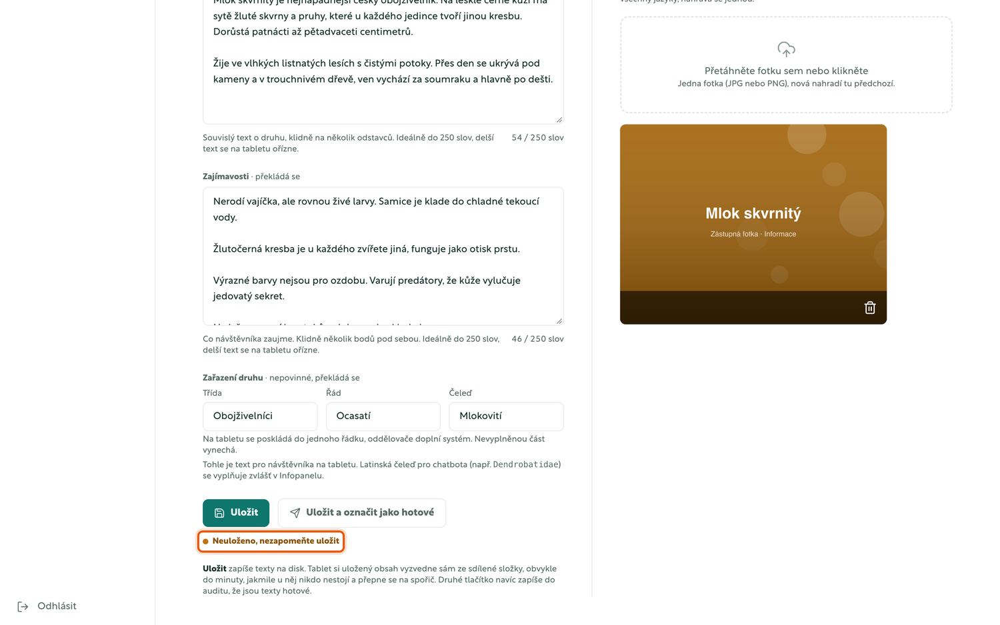

*Obrázek 11.2 — Oranžová tečka a nápis „Neuloženo, nezapomeňte uložit“. Když je
uloženo, píše se tu čas posledního uložení.*

A kdybyste chtěli odejít na jinou stránku s neuloženými změnami, systém vás
zastaví a zeptá se. Takže se nemůže stát, že byste o práci přišli jen tím, že
kliknete vedle.

---

## 12. Analytika: kolik lidí se u displejů zastaví

V levém menu je položka **Analytika**. Ukazuje, jak návštěvníci tablety
doopravdy používají.

**Nic se tu nevyplňuje ani nemění.** Je to jen ke koukání.

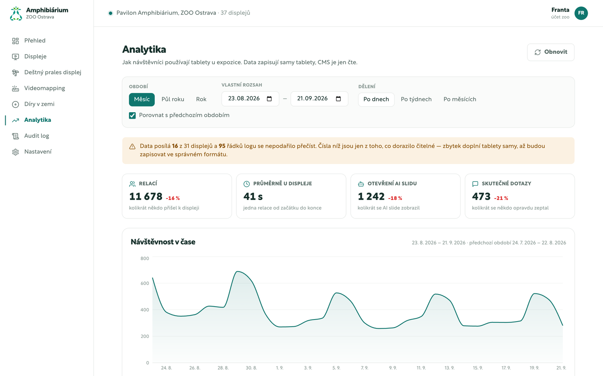

*Obrázek 12.1 — Stránka Analytika: nahoře ovládání období, pod ním čísla
a graf.*

### Výběr období

Nahoře si vyberete, za jakou dobu chcete čísla vidět.

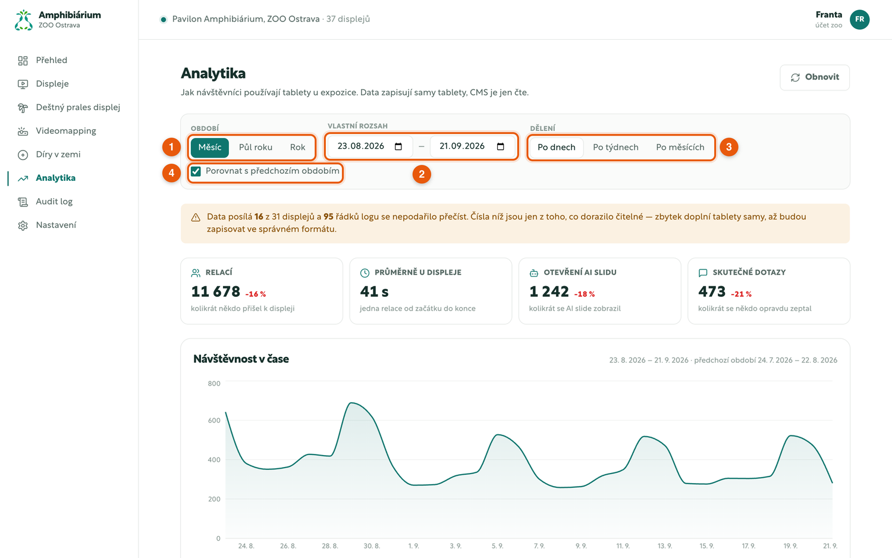

*Obrázek 12.2 — 1 Měsíc / Půl roku / Rok, 2 vlastní rozsah od–do, 3 dělení
grafu, 4 porovnání s předchozím obdobím.*

- **Měsíc / Půl roku / Rok** — tři nejčastější období jedním kliknutím.
- **Vlastní rozsah** — dvě políčka s datem, od kdy do kdy.
- **Dělení** — jestli se má graf kreslit po dnech, týdnech, nebo měsících.
  Systém to vybere sám podle délky období, ale můžete ho přepnout.
- **Porovnat s předchozím obdobím** — zaškrtávátko, viz níž.

### Čtyři čísla nahoře

| Číslo | Co znamená |
|---|---|
| **Relací** | Kolikrát někdo přišel k displeji a začal ho používat. |
| **Průměrně u displeje** | Jak dlouho u něj návštěvník v průměru stráví. |
| **Otevření AI slidu** | Kolikrát se zobrazila obrazovka s umělou inteligencí. |
| **Skutečné dotazy** | Kolikrát se někdo opravdu na něco zeptal. |

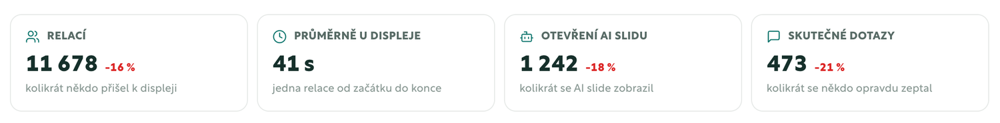

*Obrázek 12.3 — Čtyři čísla. Červené procento znamená, že je to proti
minulému období míň.*

Poslední dvě čísla se schválně počítají zvlášť. Otevřít obrazovku a napsat
na ni dotaz jsou dvě různé věci a rozdíl mezi nimi je zajímavý.

Když máte zaškrtnuté **porovnání**, je u čísla ještě zelená nebo červená
změna v procentech proti předchozímu stejně dlouhému období.

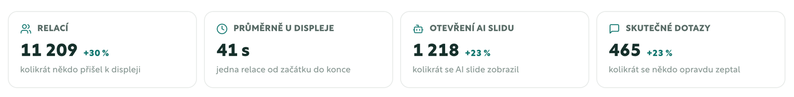

*Obrázek 12.4 — Jiné období, stejné dlaždice: zelené procento znamená nárůst.*

### Graf návštěvnosti

Hlavní graf ukazuje, jak se návštěvnost vyvíjela v čase.

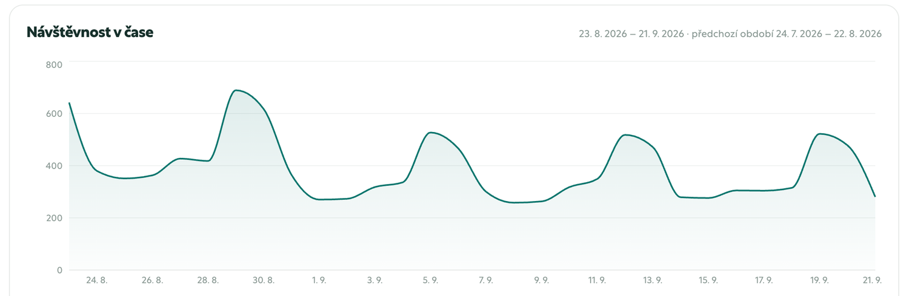

*Obrázek 12.5 — Graf za měsíc. Pravidelné špičky jsou víkendy.*

Najetím myší na graf se ukáže přesné datum a číslo.


*Obrázek 12.6 — Po najetí myší se objeví bublina s datem a počtem relací.*

### Dva žebříčky dole

**Nejsledovanější displeje** — u kterých zvířat se lidé zastavují nejvíc.
Vpravo je průměrná doba, kterou u displeje stráví.

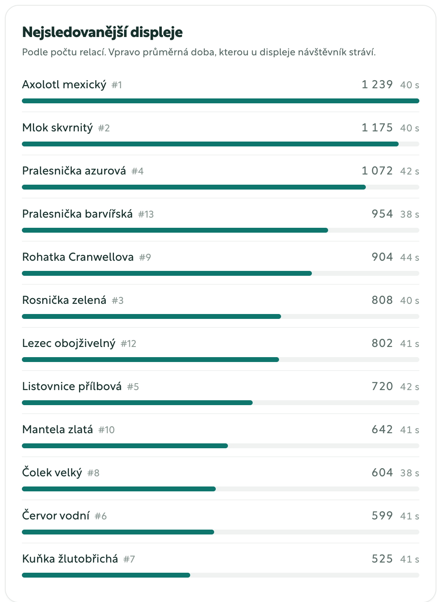

*Obrázek 12.7 — Žebříček displejů. Šedé číslo za názvem je číslo displeje
v pavilonu.*

**Typy slidů** — co si lidé pouštějí nejčastěji. Vpravo průměrná doba na
jednom slidu.

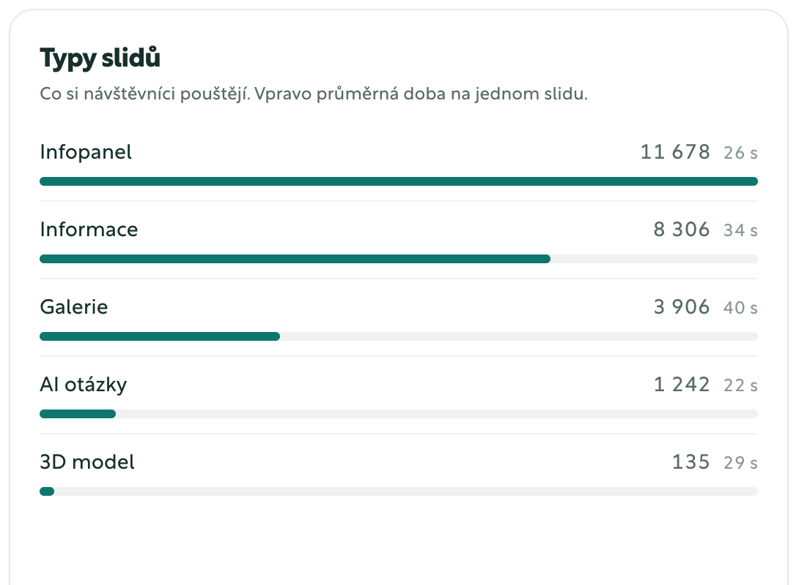

*Obrázek 12.8 — Žebříček typů slidů.*

### Oranžové upozornění nahoře

Občas se nahoře objeví oranžový pruh, že se část záznamů nepodařilo přečíst,
nebo že data posílají jen některé tablety.

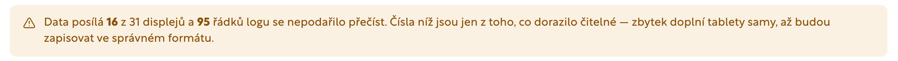

*Obrázek 12.9 — Upozornění, že data posílá jen část tabletů.*

Není to vaše chyba a není to porucha systému. Znamená to jen, že čísla níž
jsou z toho, co dorazilo čitelné. Až budou všechny tablety zapisovat správně,
upozornění zmizí samo.

---

## 13. Když něco nejde

### Nejde mi uložit

Nejspíš je někde text přes limit. Projeďte slide očima a hledejte **červené
políčko**. U něj je napsáno, o kolik jste přes, a nad tlačítky pro uložení
svítí červená věta s názvem pole.

Když na „Uložit“ přesto kliknete, systém napíše „Zkraťte prosím: …“ a neuloží.
Zkraťte text v označeném poli a zkuste to znovu.

Když je slide úplně prázdný, taky ho nejde označit za hotový. Systém to
napíše červeně dole.

### Odhlásilo mě to

Systém odhlašuje po hodině, kdy s ním nic neděláte. Na přihlašovací obrazovce
to i napíše.

Přihlaste se znovu a vyberte jméno. Uložené změny jsou v pořádku, přijdete
jen o rozepsané a neuložené.

Příště si všimněte **upozornění minutu předem** — stačí kliknout na
„Pokračovat v práci“.

### Nevidím svoje jméno v seznamu

Přidáte si ho sami. Pod seznamem je odkaz **„Není tu moje jméno / upravit
seznam“**. Podrobně v [kapitole 2](#2-přihlášení-a-výběr-jména).

### Na tabletu se nic nezměnilo

Zkontrolujte popořadě:

1. **Uložili jste?** U textů je potřeba kliknout na „Uložit“. Fotky se
   ukládají samy.
2. **Počkali jste chvíli?** Tablet si obsah bere obvykle do minuty.
3. **Nestojí u tabletu návštěvník?** Tablet se aktualizuje, až u něj nikdo
   není a obrazovka se přepne na spořič.
4. **Nesvítí u displeje červená tečka?** Pak tablet neběží a čeká, až ho
   někdo zapne.

Pomůže i **Náhled tabletu** (viz [kapitola 4](#4-jak-otevřít-konkrétní-zvíře)).
Když je změna vidět v náhledu, je uložená a problém je na straně tabletu.

Když nic z toho nepomůže, ozvěte se správci.

### Fotka je na tabletu divně oříznutá

Otevřete u ní oříznutí a posuňte výřez. Originál fotky systém drží stranou,
takže se opakovaným ořezáváním nic nezkazí.
Viz [kapitola 7](#7-fotky-a-jejich-oříznutí).

### Nahrál jsem video a systém ho nevzal

Tablet přehraje jen **MP4 (H.264) do 200 MB**. Jiné formáty systém odmítne
schválně, aby se na tabletu neobjevila černá obrazovka. O převod požádejte
správce.

### Zmizel mi rozepsaný text

Nejspíš vás odhlásilo, nebo jste odešli na jinou stránku. Uložený text zmizet
nemůže.

Do budoucna: ukládejte průběžně, klidně každých pár minut. Tlačítko „Uložit“
se dá mačkat kolikrát chcete.

### Vidím nahoře cizí jméno

Pracujete pod jménem někoho jiného, kdo se zapomněl odhlásit. Odhlaste se
dole vlevo a přihlaste se znovu se svým jménem.

### Bojím se, že jsem něco smazal

Podívejte se do **Audit logu** v levém menu. Je v něm každá změna i s tím,
kdo ji udělal a kdy. Podle toho se dá dohledat, co se stalo.

Texty i fotky jdou vrátit tím, že je napíšete nebo nahrajete znovu. Jediné,
co se vrátit nedá, je smazaný celý slide.

---

## 14. Displej u deštného pralesa

Displej u deštného pralesa je jiný než ostatní. Neukazuje informace o zvířeti,
ale **stav prostředí v pavilonu** a **odpočet do další bouřky**.

Nastavuje se proto na vlastní stránce: v levém menu **Deštný prales displej**.
Ostatních displejů se to nijak netýká.

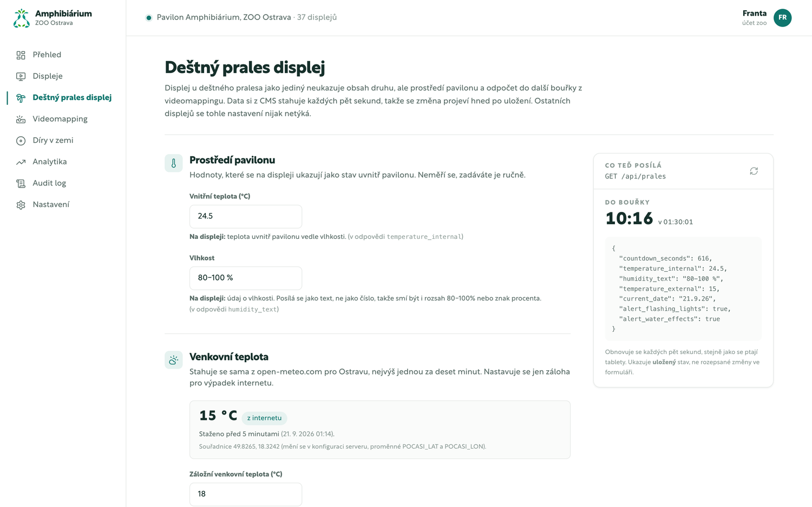

*Obrázek 14.1 — Stránka deštného pralesa. Vlevo formulář, vpravo náhled toho,
co se displeji právě posílá.*

### Co se nastavuje

| Pole | Co s tím |
|---|---|
| **Vnitřní teplota** | Teplota uvnitř pavilonu. Neměří se sama, zadáváte ji ručně. |
| **Vlhkost** | Píše se jako text, smí to být i rozsah, třeba „80-100 %“. |
| **Záložní venkovní teplota** | Jen pro případ výpadku internetu, viz níž. |
| **Odpočet do bouřky** | Přepínač. Vypnutý odpočet displej neukazuje. |
| **Bouřka každých… minut** | Jak často se bouřka opakuje. |
| **Blikající světla** | Přepínač varování pro návštěvníky. |
| **Vodní efekty** | Přepínač varování. U bouřky se doopravdy rozprašuje voda. |

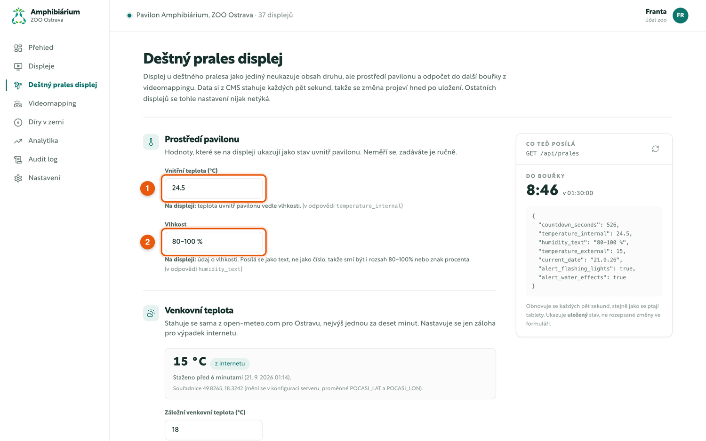

*Obrázek 14.2 — 1 Vnitřní teplota, 2 Vlhkost. Pod každým polem je napsané, kde
přesně se údaj na displeji objeví.*

Desetinná čísla jde psát s čárkou i s tečkou, obojí systém vezme.

### Odpočet do bouřky

Zadáváte jen interval, třeba 15 minut. Zbytek si systém dopočítá sám.

Bouřky jdou v pevném rytmu od půlnoci: při patnácti minutách padnou na 0:15,
0:30, 0:45, 1:00 a tak dál. Systém to i připomíná v šedém rámečku pod polem.

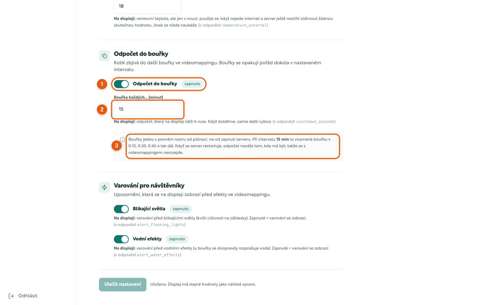

*Obrázek 14.3 — 1 přepínač odpočtu, 2 interval v minutách, 3 vysvětlení, na
jaké časy bouřky vyjdou.*

Odpočet jde vypnout přepínačem. **Nastavený interval přitom zůstane uložený**,
takže ho při zapnutí nemusíte psát znovu.

### Venkovní teplota

Venkovní teplotu **nenastavujete**. Systém si ji sám stahuje z internetu pro
Ostravu, nejvýš jednou za deset minut.

V rámečku nad polem je vidět, jaká hodnota se zrovna posílá a kdy naposledy
se ji podařilo stáhnout.

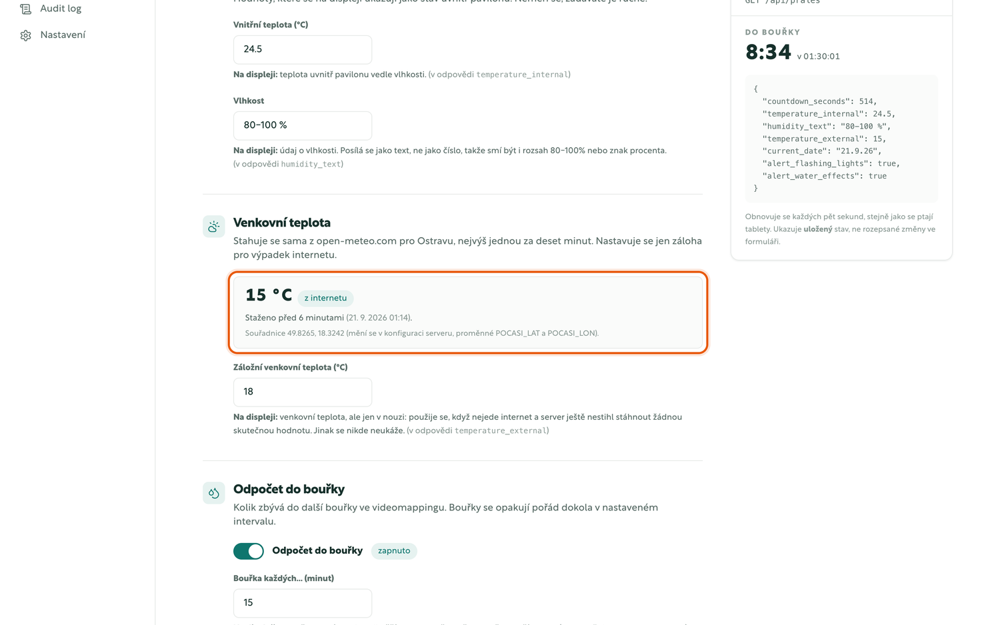

*Obrázek 14.4 — Odznak „z internetu“ znamená, že hodnota je čerstvá. Pod ní je
čas posledního stažení.*

**Záložní venkovní teplota** je pojistka pro výpadek internetu. Nastavte ji
na hodnotu, která je pro roční období věrohodná, ať displej při výpadku
neukazuje nesmysl.

### Náhled vpravo

Vpravo je vidět **přesně to, co displeji zrovna posíláme**: velký odpočet do
bouřky a pod ním technický výpis všech hodnot. Obnovuje se každých pět sekund,
stejně jako se ptá tablet.

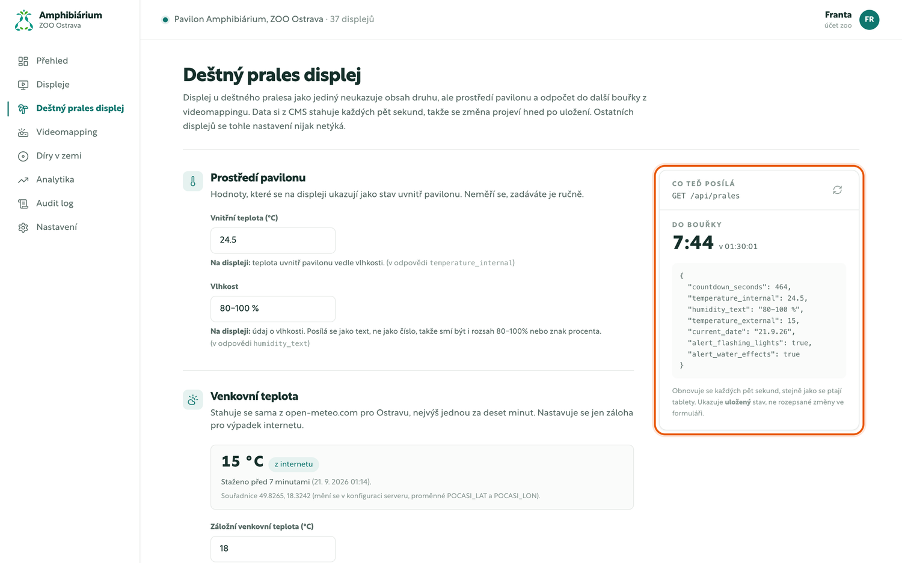

*Obrázek 14.5 — Náhled „Co teď posílá“. Technického výpisu se nelekejte, je to
jen kontrola pro správce.*

Náhled ukazuje **uložený** stav. Dokud změny neuložíte tlačítkem **Uložit
nastavení**, displej o nich neví. Jakmile něco změníte, objeví se vedle ještě
tlačítko **Zahodit změny** — tím se vrátíte k naposledy uloženému stavu.

---

## 15. Videomapping, zapnutí a vypnutí

V levém menu je položka **Videomapping**. Jsou tam dvě instalace, tak jak je
znáte z pavilonu:

- **WaterSense**
- **Les**

U každé je tlačítko **Zapnout** a **Vypnout**.

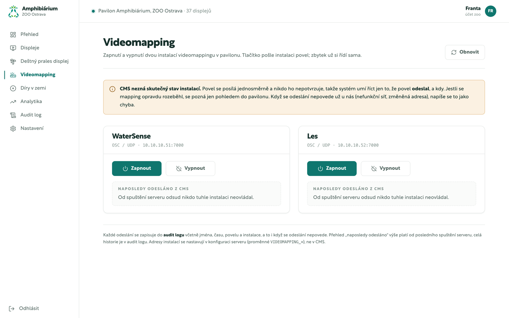

*Obrázek 15.1 — Vlevo WaterSense, vpravo Les. Nahoře je oranžové vysvětlení,
co systém umí a co ne.*

### Co systém ví a co ne

> **Systém nepozná, jestli mapping opravdu běží.**
> Povel se posílá jedním směrem a instalace na něj neodpovídá. Systém tedy
> umí potvrdit jen to, že povel **odeslal**, a kdy.

Proto tu nenajdete žádnou kontrolku „zapnuto“. Po kliknutí se pod tlačítky
objeví jen záznam, například:

```
NAPOSLEDY ODESLÁNO Z CMS
Odeslán povel k zapnutí dnes v 12:03:28, Franta.
```

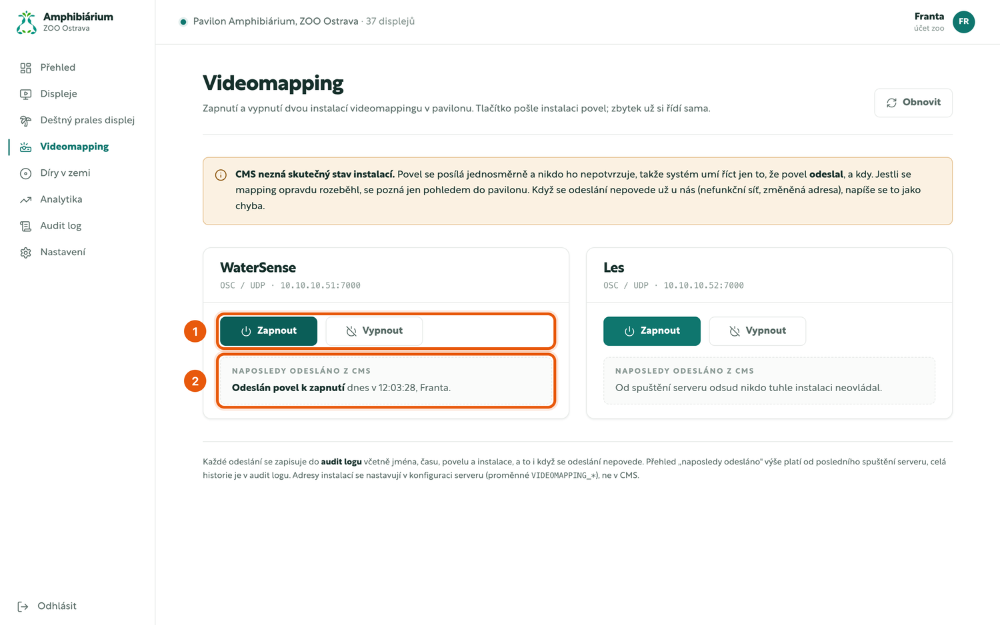

*Obrázek 15.2 — 1 tlačítka Zapnout a Vypnout, 2 záznam o posledním odeslaném
povelu.*

Je v něm i jméno, které jste si vybrali při přihlášení, takže je rovnou vidět,
kdo tlačítko naposledy zmáčkl.

Jestli se mapping rozeběhl, poznáte **jen pohledem do pavilonu**. Když si
nejste jistí, klidně tlačítko zmáčkněte znovu. Opakovaný povel nevadí.

### Když se povel nepodaří odeslat

Objeví se červené hlášení **„Povel se nepodařilo odeslat“** i s důvodem.
V takovém případě se k instalaci nedostal a je potřeba volat správce.

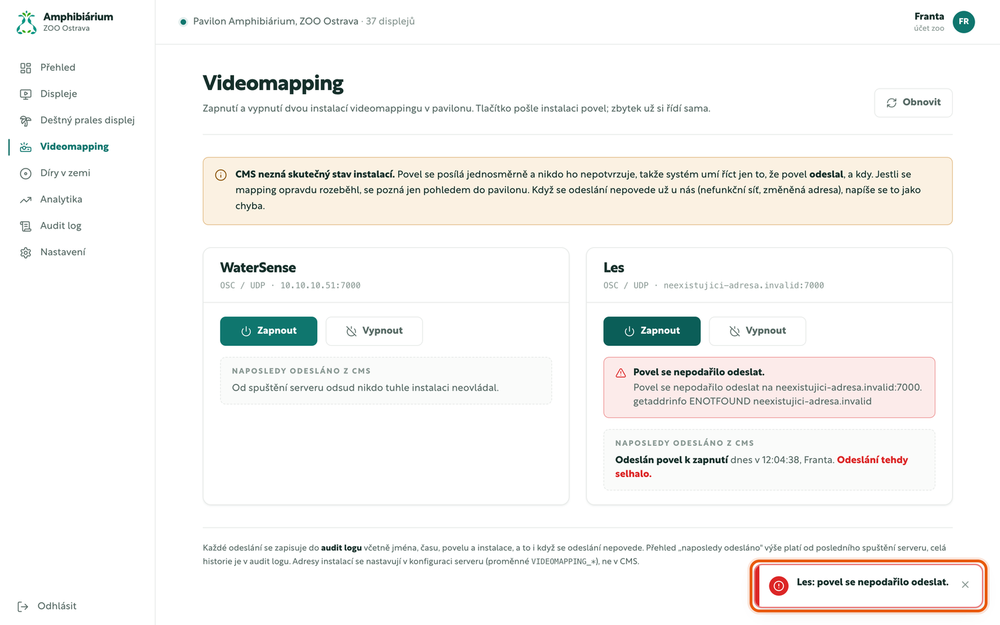

*Obrázek 15.3 — Chyba u instalace Les. Červeně je i poznámka „Odeslání tehdy
selhalo“ u záznamu a hláška v rohu obrazovky. (Adresa na obrázku je schválně
nefunkční, aby šla chyba ukázat.)*

Pozor na opačný případ: **když se chyba neobjeví, ještě to neznamená, že
povel dorazil.** Znamená to jen, že odešel z našeho serveru. Když se mapping
nerozeběhne a přitom nesvítí chyba, je problém v pavilonu.

### Každé zmáčknutí se zapíše

Do **Audit logu** se zapíše vaše jméno, čas, povel a instalace — a to i když
se odeslání nepovede. Přehled „naposledy odesláno“ na stránce platí jen od
posledního spuštění systému, úplná historie je v audit logu.

---

*Konec příručky. Když v ní něco chybí nebo nesedí, řekněte to správci
systému — příručka se dá doplnit.*
